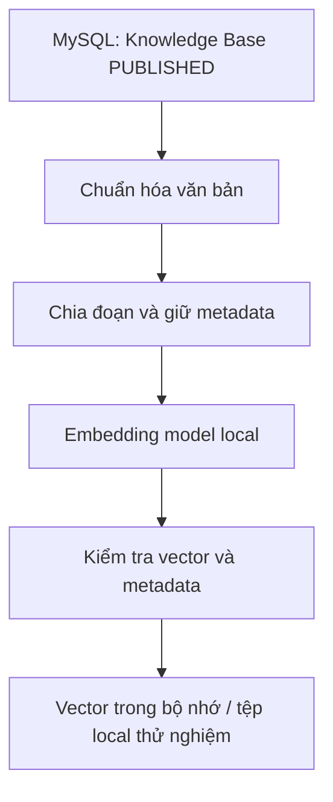
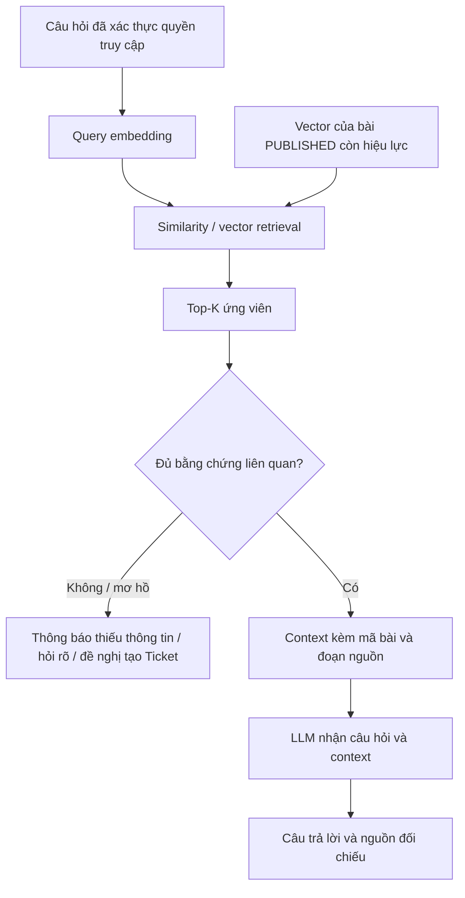

# Giai đoạn 5.1 – Nghiên cứu RAG và thiết kế thực nghiệm

Ngày nghiên cứu: 28/09/2026. Phạm vi: nghiên cứu tài liệu chính thức, đọc code và dữ liệu hiện có, đề xuất thiết kế; không triển khai pipeline hoặc chạy mô hình.

## 1. Mục tiêu nghiên cứu

Xác định cách áp dụng RAG cho tra cứu và hỗ trợ xử lý sự cố CNTT nội bộ dựa trên Knowledge Base hiện có. Tài liệu giải thích thuật toán, lựa chọn ban đầu và cách đo để sinh viên có thể trình bày, tái tạo ở các giai đoạn sau.

| Trạng thái | Nội dung |
| --- | --- |
| ĐÃ CÓ | Authentication/JWT/RBAC, Ticket/history, Knowledge Base và tìm kiếm từ khóa |
| ĐÃ NGHIÊN CỨU | Kiến trúc RAG, chunking, embedding, lưu vector, thiết kế đánh giá |
| CHƯA TRIỂN KHAI | Chunking pipeline, embedding, vector search/retrieval, LLM, chatbot |

Kiểm tra Git ban đầu: main sạch, HEAD f61b722 (docs: finalize knowledge base stage), hash local và refs/heads/main trên remote cùng f61b72218d195e6f3accc689a627a14652eaa28e. GĐ5.1 chỉ tạo tài liệu này, không sửa source/schema/dependency/.env hoặc dữ liệu MySQL.

## 2. Bài toán

Employee thường mô tả triệu chứng thay vì gõ đúng tiêu đề bài. Ví dụ “mọi người trong cuộc họp không nghe được tôi” có thể liên quan bài về microphone dù thiếu từ microphone. Hiện frontend chỉ tìm chuỗi trong code/title nên có thể bỏ sót cách diễn đạt này.

Mục tiêu nghiên cứu là đo xem truy xuất ngữ nghĩa có giúp tìm đúng hướng dẫn hơn trong bộ dữ liệu này hay không. Chưa có bằng chứng rằng RAG luôn tốt hơn hoặc cần thiết cho tám bài; tìm kiếm từ khóa vẫn hữu ích, dễ kiểm tra và phải giữ làm mốc so sánh. Câu hỏi có mã bài cụ thể thường phù hợp tìm chính xác hơn tìm theo ngữ nghĩa.

Không dùng Ticket hoặc thông tin tài khoản làm corpus. Hệ thống chỉ hỗ trợ tra cứu, không tự sửa thiết bị, cấp quyền hoặc đặt lại mật khẩu.

## 3. RAG là gì

RAG (Retrieval-Augmented Generation) kết hợp truy xuất tài liệu liên quan với mô hình sinh ngôn ngữ. Tài liệu truy xuất bổ sung căn cứ cho câu trả lời; không đồng nghĩa huấn luyện lại LLM bằng dữ liệu của dự án. Bài báo nền tảng mô tả kết hợp mô hình tham số với bộ nhớ tài liệu bên ngoài. [Lewis và cộng sự, 2020](https://arxiv.org/abs/2005.11401).

| Thuật ngữ | Giải thích trong đồ án |
| --- | --- |
| Chunking | Chia bài thành đoạn nhỏ để lập chỉ mục, giữ liên kết về bài gốc |
| Embedding | Mô hình biến văn bản thành vector số biểu diễn các đặc trưng học được, có thể phản ánh ngữ nghĩa |
| Vector | Dãy số có số chiều cố định; không phải văn bản mã hóa có thể giải mã nguyên vẹn |
| Similarity search | So sánh vector câu hỏi với vector đoạn để xếp thứ tự ứng viên |
| Top-K | Tối đa K ứng viên đứng đầu theo tiêu chí đã chọn, không bảo đảm cả K đều đúng |
| Context | Những đoạn nguồn đã chọn và metadata được cung cấp cho bước sinh câu trả lời |
| LLM | Diễn đạt/tổng hợp câu trả lời dựa trên câu hỏi và context; vẫn có thể sai |
| Sources | Mã bài, tiêu đề, article_id/chunk_index để người dùng và người chấm kiểm tra căn cứ |

Vector gần nhau chỉ là tín hiệu của mô hình và metric, không chứng minh hai câu giống hệt nhau hoặc hướng dẫn đúng với mọi tình huống. RAG cũng không bảo đảm loại bỏ hoàn toàn thông tin bịa đặt.

## 4. RAG áp dụng vào project như thế nào

ĐÃ CÓ: Node.js/Express + mysql2, MySQL it_support_rag, React/Vite. Code đã đọc gồm schema KB, knowledgeArticleModel, controller/routes, KnowledgeBase.jsx, cấu hình package và tổng kết GĐ4.5.

| Cách tra cứu | Cơ chế | Vai trò trong nghiên cứu |
| --- | --- | --- |
| Keyword Search hiện tại | includes trên chuỗi code/title, trim, không phân biệt hoa/thường | Mốc hành vi đang hoạt động; không có similarity hoặc xếp hạng theo độ liên quan |
| Semantic Retrieval đề xuất | Embedding câu hỏi/đoạn rồi so sánh vector | Tìm đoạn có liên quan dù cách diễn đạt khác; chưa sinh câu trả lời |
| RAG đề xuất | Retrieval + chọn context + LLM + nguồn | Trả lời có căn cứ; phụ thuộc chất lượng retrieval và generation |

Thực nghiệm ban đầu là script backend riêng, không gắn vào request nghiệp vụ. Lưu kết quả dẫn xuất ngoài schema MySQL. Chỉ ở giai đoạn được giao triển khai hỏi đáp mới tích hợp JWT/RBAC và giao diện; không tạo endpoint mới ở GĐ5.1 hoặc mặc nhiên ở GĐ5.2.

## 5. Kiến trúc đề xuất

### 5.1 Luồng chuẩn bị tri thức — CHƯA TRIỂN KHAI

### 5.2 Luồng hỏi đáp — ĐỀ XUẤT CHO GIAI ĐOẠN SAU

Đề xuất kiểm tra status và phiên bản nguồn trước khi dùng context: bài vừa ARCHIVED hoặc sửa nội dung không được tiếp tục trả qua index cũ. updated_at và content hash hỗ trợ phát hiện thay đổi; MySQL là nguồn chuẩn. Không chỉ dựa vào status sao chép trong file vector. Nội dung truy xuất là dữ liệu tham khảo, không được coi là chỉ thị hệ thống; đây là nguyên tắc thiết kế cho bước generation sau này.

## 6. Nguồn dữ liệu Knowledge Base

Đã đọc trực tiếp MySQL bằng SELECT trong GĐ5.1: users=3, tickets=3, ticket_history=17, knowledge_articles=8. Cả tám bài PUBLISHED và created_by là IT demo it@test.local. Không chạy seed hoặc thao tác ghi.

Bảng dưới là thống kê văn bản gốc đã đọc, chưa phải kết quả chunking. “Ký tự” tính Unicode code point, có khoảng trắng/line break; “đơn vị trắng” đếm phần tách bởi khoảng trắng, không phải từ tiếng Việt theo ngôn ngữ học và không phải token mô hình.

| Chủ đề chuẩn dùng cho nhãn | Mã thực tế | Tiêu đề | Ký tự gốc | Đơn vị trắng |
| --- | --- | --- | ---: | ---: |
| wifi | KB-000008 | Không kết nối được Wi-Fi | 1140 | 249 |
| printer | KB-000009 | Máy in không in được tài liệu | 1231 | 267 |
| account-password | KB-000010 | Quên mật khẩu tài khoản nội bộ | 1287 | 273 |
| email | KB-000011 | Không gửi hoặc nhận được email | 1232 | 270 |
| slow-computer | KB-000012 | Máy tính hoạt động chậm | 1247 | 270 |
| network-folder | KB-000013 | Không truy cập được thư mục mạng nội bộ | 1248 | 269 |
| microphone | KB-000014 | Microphone không hoạt động khi họp trực tuyến | 1265 | 262 |
| internal-website | KB-000015 | Không truy cập được website nội bộ | 1247 | 266 |

Mã là quan sát hiện tại, không dùng làm hằng số trong pipeline tương lai. Liên kết nguồn bằng id/code thực tế; nhãn chủ đề trong bộ câu hỏi ánh xạ sang bài hiện tại trước mỗi đợt đánh giá.

Nguồn duy nhất được đề xuất: knowledge_articles với điều kiện status='PUBLISHED'. Không lấy DRAFT/ARCHIVED kể cả người chạy script là ADMIN. Schema đã có UNIQUE code, enum DRAFT/PUBLISHED/ARCHIVED, tác giả liên kết users bằng FK RESTRICT; không cần thêm cột cho GĐ5.2.

Mỗi đoạn dự kiến giữ article_id, code, title, status, chunk_index bắt đầu từ 0, chunk_text; có thể thêm source_updated_at, source_hash, offset trên văn bản đã chuẩn hóa, model_revision và chunk_config. Không đưa password, JWT hoặc dữ liệu users vào representation.

## 7. Nghiên cứu Chunking

### 7.1 Ba phương án

| Phương án | Ưu điểm | Nhược điểm / rủi ro | Vai trò đề xuất |
| --- | --- | --- | --- |
| Giữ nguyên toàn bài | Đơn giản, đủ các bước và điều kiện cảnh báo; dễ truy vết | Nội dung nhiều mục bị gom chung; có thể vượt giới hạn token | Đối chứng khi toàn bộ input thực sự vừa model; không âm thầm cắt phần cuối |
| Fixed-size | Kích thước rõ, dễ lặp lại, kiểm thử coverage đơn giản | Có thể cắt giữa câu/bước xử lý; overlap gây lặp | Đối chứng cùng ngân sách độ dài với phương án chính |
| Theo đoạn/paragraph | Giữ các mục “Hiện tượng”, “Nguyên nhân”, “Các bước”, “Khi nào gửi Ticket” gần nội dung tương ứng | Độ dài không đều; mục các bước có thể dài, đoạn ngắn thiếu ngữ cảnh | Nền tảng phương án chính, kết hợp giới hạn độ dài |

### 7.2 Phương án ban đầu cho GĐ5.2

Chọn chia ưu tiên ranh giới đoạn, có giới hạn độ dài và overlap trong cùng bài (hybrid đơn giản). Đây là lựa chọn thiết kế của đồ án, chưa có thực nghiệm chứng minh tối ưu.

| Cấu hình đề xuất | Giá trị | Ý nghĩa |
| --- | --- | --- |
| CHUNK_SIZE | 800 | Tối đa 800 Unicode code point của chunk_text sau chuẩn hóa, gồm phần overlap |
| CHUNK_OVERLAP | 120 | Tối đa 120 code point lấy lại ở cuối đoạn trước; có thể ít hơn để giữ ranh giới và tiến lên |
| Đơn vị | Unicode code point | Không dùng byte, không coi String.length UTF-16 là tương đương mọi trường hợp |
| chunk_index | 0, 1, 2, ... | Liên tiếp trong từng article |

Cơ sở khởi đầu: bài hiện khoảng 1.140–1.287 ký tự, gồm bốn mục; giới hạn 800 cho phép giữ một nhóm nội dung tương đối đủ trong khi vẫn thử tách các bài này. Overlap 120 tương đương 15% giới hạn, nhằm giảm mất liên kết ở chỗ cắt. Hai giá trị do thiết kế chọn, không lấy từ benchmark và không suy ra số chunk trước khi chạy.

Quy tắc dự kiến, mô tả thuật toán chứ chưa viết code:

1. Chuẩn hóa CRLF/CR về LF, Unicode NFC, trim đầu/cuối; bỏ khoảng trắng cuối dòng và thu gọn nhiều dòng trống liên tiếp. Giữ dấu tiếng Việt, chữ hoa của thuật ngữ, phủ định, số thứ tự, dấu câu, URL và cấu hình kỹ thuật; không dịch, không bỏ stopword. Không tự gộp khoảng trắng bên trong đoạn lệnh kỹ thuật.
2. Giữ nguyên marker demo và cảnh báo nguồn demo trong bản chuẩn hóa ban đầu để dễ chứng minh coverage. Nếu sau này muốn loại boilerplate phải là biến thể được ghi nhận riêng, không sửa bài gốc.
3. Đọc tuần tự từng bài; ưu tiên kết thúc tại ranh giới paragraph gần nhất trong giới hạn. Đoạn quá dài thì ưu tiên xuống dòng hoặc khoảng trắng, chỉ cắt theo code point khi không có ranh giới phù hợp. Không trộn hai bài vào cùng chunk; hạn chế tách heading khỏi nội dung nếu còn chỗ.
4. Bắt đầu đoạn tiếp theo với phần chồng lấn tối đa 120 ký tự; bảo đảm con trỏ luôn tiến, không sinh đoạn rỗng hoặc một đoạn chỉ lặp lại phần đã xử lý. Chunk cuối có thể ngắn. Bài ngắn vừa cả hai giới hạn ký tự và token được giữ một chunk.
5. Đếm token của toàn input embedding gồm prefix, title, chunk_text và special tokens bằng tokenizer thực tế. Nếu vượt giới hạn model thì thu ngắn/chia tiếp, giữ phần dư cho chunk sau; không dùng truncation để âm thầm bỏ nội dung. Nếu riêng title/prefix không vừa, báo lỗi rõ để điều chỉnh thiết kế, không giả vờ thành công.
6. Kiểm tra các span hợp lại bao phủ nội dung chuẩn hóa (bỏ qua khoảng trắng biên do trim), không chỉ kiểm tra mỗi bài có ít nhất một chunk. Ghi độ dài/overlap thực tế, vì chúng có thể nhỏ hơn hằng số cấu hình.

Ví dụ minh họa cấu trúc, CHƯA phải output chunking: bài Wi-Fi có nhóm “Hiện tượng + Nguyên nhân”, nhóm “Các bước kiểm tra” và nhóm “Khi nào cần gửi Ticket”. Thuật toán có thể ghép hoặc tách các nhóm này tùy giới hạn; không khẳng định bài sẽ tạo đúng ba chunk.

GĐ5.2 cần đo tổng chunk, số chunk/bài, min/max/trung bình độ dài và token, coverage, thời gian preprocessing/chunking. Chưa chọn phương án “tốt nhất” bằng độ dài chunk; đánh giá retrieval thuộc bước sau.

## 8. Nghiên cứu Embedding

### 8.1 Các phương án khảo sát

| Phương án | Provider/cách chạy | API key | Dimension / input | Nhận xét cho đồ án |
| --- | --- | --- | --- | --- |
| intfloat/multilingual-e5-small | Chạy local; bản ONNX Xenova trên Hugging Face | Không cần key cho inference local với model công khai | 384; tối đa 512 token | Ưu tiên ban đầu: có tiếng Việt trong model card, hợp với thí nghiệm nhỏ; chất lượng CNTT phải đo [E5](https://huggingface.co/intfloat/multilingual-e5-small/raw/main/README.md) |
| BAAI/bge-m3 | Model local của BAAI | Không cần key khi chạy local | Dense vector 1024; tối đa 8192 token | Đa ngôn ngữ; context dài, có nhiều chế độ retrieval. Với corpus ngắn, khả năng này chưa phải nhu cầu bắt buộc; cần đo tài nguyên trước khi cân nhắc [BGE-M3](https://huggingface.co/BAAI/bge-m3) |
| embed-multilingual-v3.0 | Dịch vụ Cohere Embed | Có | 1024; tối đa 512 token | Có hỗ trợ tiếng Việt; API giảm việc vận hành model nhưng phụ thuộc mạng, hạn mức và việc gửi nội dung ra ngoài [Models](https://docs.cohere.com/v2/docs/models), [ngôn ngữ](https://docs.cohere.com/docs/cohere-embed) |

Cohere có key thử nghiệm giới hạn và key production trả phí; không giả định dịch vụ miễn phí vô hạn. GĐ5.1 không tạo tài khoản, lấy key hoặc gọi API inference. [Tài liệu key và hạn mức](https://docs.cohere.com/docs/rate-limits).

### 8.2 Lựa chọn đủ cụ thể để chuẩn bị GĐ5.2

**Ưu tiên chốt cho lần thực nghiệm đầu: inference local trên CPU, model gốc intfloat/multilingual-e5-small, artifact ONNX Xenova/multilingual-e5-small, dùng Transformers.js ở backend Node.js.** Đây là lựa chọn ban đầu, không phải chứng nhận model tối ưu cho tiếng Việt.

Bản Xenova cung cấp ONNX tương thích Transformers.js; repository có model_quantized.onnx khoảng 118 MB, chưa tính tokenizer/runtime/cache. Đề xuất dùng bản lượng tử hóa q8 cho lần đầu, ghi đúng tên artifact thực tế; không tải toàn bộ các biến thể. [Model ONNX](https://huggingface.co/Xenova/multilingual-e5-small), [danh sách artifact](https://huggingface.co/Xenova/multilingual-e5-small/tree/main/onnx).

Theo E5: dùng prefix passage: cho tài liệu và query: cho câu hỏi kể cả tiếng Việt; lấy mean pooling có attention mask rồi chuẩn hóa L2. Không lấy tensor theo từng token làm vector của cả đoạn. [Hướng dẫn E5](https://huggingface.co/intfloat/multilingual-e5-small/raw/main/README.md).

Input tài liệu được đề xuất là passage: + title + xuống dòng + chunk_text. Code chỉ giữ ở metadata để không biến mã bài thành nội dung ngữ nghĩa. GĐ5.2 chỉ tạo vector tài liệu; quy tắc query dành cho GĐ5.3, không triển khai sớm.

Transformers.js có hướng dẫn Node.js và CommonJS qua dynamic import, phù hợp backend hiện tại mà không cần đổi toàn bộ package sang ESM hoặc thêm dịch vụ Python. Đây mới là đề xuất dependency @huggingface/transformers, chưa cài. [Hướng dẫn Node.js chính thức](https://huggingface.co/docs/transformers.js/en/tutorials/node).

Lý do lựa chọn của đồ án: không cần dịch vụ embedding trả phí hoặc API key, văn bản KB không phải gửi đến inference bên ngoài, giữ luồng thực nghiệm trong Node.js, vector nhỏ dễ quan sát. Máy vẫn cần tải artifact công khai lần đầu ở GĐ5.2 và đủ RAM/đĩa để chạy; chưa đo hiệu năng hoặc xác nhận tương thích trên máy này.

Tái tạo dự kiến: cố định version thư viện trong lockfile, revision model/tokenizer, tên artifact/dtype, pooling, normalization, prefix, chunk config, content hash và Node/OS/CPU. Không ghi “main/latest” như định danh duy nhất của lần đo. Cache model để local và loại khỏi Git; không tạo cache ở GĐ5.1.

Phương án dự phòng: cùng E5 với ONNX fp32 nếu q8 có lỗi tương thích/chất lượng sau kiểm chứng, ghi rõ thay đổi dtype và đo lại; BGE-M3 là ứng viên thay model khi có bằng chứng cần context/năng lực khác, phải ghi lý do và không so trực tiếp vector khác model. Không tự chuyển sang Cohere hoặc dịch vụ có key/chi phí khi local gặp lỗi; dừng báo lựa chọn cần thiết.

## 9. Nghiên cứu Vector Retrieval/Storage

| Phương án | Ưu điểm | Nhược điểm | Đề xuất |
| --- | --- | --- | --- |
| Vector trong memory | Không dịch vụ mới, dễ kiểm tra metadata/số chiều | Mất khi tiến trình dừng; quét toàn bộ tăng chi phí theo corpus | Ưu tiên GĐ5.2 |
| File JSON local dẫn xuất | Dễ xem, tái tạo và đối chiếu; phù hợp ít bài | Có thể lỗi thời, phình lớn, không tốt cho nhiều tiến trình ghi | Tùy chọn cache nhỏ ngoài Git; lưu summary vào báo cáo |
| MySQL hiện có | Nguồn bài và trạng thái đã tập trung | Thêm nơi lưu vector cần schema/đồng bộ; lưu JSON không tự tạo bộ tìm láng giềng | Chỉ giữ MySQL làm nguồn chuẩn; chưa đề xuất migration hoặc phụ thuộc tính năng vector theo phiên bản |
| Qdrant | Có lưu/tìm vector và lọc payload | Thêm dịch vụ, index, vận hành và đồng bộ dữ liệu | Chỉ khảo sát; chưa cần cho tám bài [Qdrant overview](https://qdrant.tech/documentation/overview/) |

GĐ5.2 ưu tiên vector trong memory, kết thúc tiến trình thì có thể tạo lại từ MySQL; nếu lưu file thì tách artifact local khỏi tài liệu Git. Không thêm bảng chunks/embeddings, không cài vector DB.

GĐ5.3 dự kiến quét cosine chính xác trên toàn bộ vector hợp lệ, độ phức tạp O(N × d) cho N chunk và d chiều, đủ đơn giản để giải thích ở quy mô này. Chỉ cân nhắc approximate index/dịch vụ riêng khi số liệu corpus/latency chứng minh cần. Chưa triển khai tìm kiếm ở GĐ5.1/5.2.

## 10. Top-K và Similarity

Đề xuất cosine similarity: cos(q, x) = (q · x) / (norm(q) × norm(x)). Vector phải cùng model/config, dimension nhất quán, số hữu hạn, norm khác 0. Nếu đều đã L2-normalize thì cosine bằng dot product. Điểm không phải xác suất câu trả lời đúng và không thể dùng một ngưỡng chung cho mọi model.

So sánh K=1, K=3, K=5: K nhỏ gọn nhưng dễ bỏ sót; K lớn tăng cơ hội có nguồn đúng đồng thời tăng nhiễu/context. Với chỉ tám bài, Hit@5 có thể cao ngay cả khi Top-1 yếu; phải trình bày cùng nhau.

Quy ước chính: K là số chunk trong danh sách xếp hạng thô; xét nguồn đúng qua article_id của các chunk đó. Nếu nhiều chunk cùng bài chiếm chỗ, ghi rõ số article phân biệt trong Top-K, không âm thầm đổi K thành số bài. Hòa điểm thì sắp article_id rồi chunk_index để tái tạo. Có thể đánh giá biến thể khử trùng theo bài riêng, phải đặt tên khác và không trộn kết quả.

Top-K thô dùng để đo ranking. Bước chọn context thực tế sau này lọc status/quyền, ngưỡng liên quan, khử trùng đoạn và ngân sách token LLM; có thể còn ít hơn K hoặc không có đoạn nào. Dùng cùng ranking lấy prefix 1/3/5 giúp so sánh nhất quán.

Mẫu ghi nhận tương lai (hiện chưa có dòng kết quả): question_id, nhóm/tập, câu hỏi, expected_topics/article_ids, run_id, model/revision/dtype, chunk_config, K, ordered_results[{article_id,code,chunk_index,similarity}], distinct_article_count, hit, threshold, decision, latency_ms. Khi chưa chạy thì để trạng thái NOT_RUN và similarity/hit/time là null, không điền số liệu minh họa dễ bị hiểu là kết quả thật.

## 11. Thiết kế bộ câu hỏi thực nghiệm

**TEST DESIGN: 24 câu, chưa chạy RAG, chưa có PASS/FAIL hoặc similarity.** A: trực tiếp/gần từ khóa (8); B: paraphrase (8); C: một phần/mơ hồ (4); D: ngoài KB (4).

expected_topics là nhãn chủ đề ở mục 6, không phải code hard-code. A/B có một nguồn đúng; C có tập ứng viên hợp lý nhưng không đủ căn cứ trả lời toàn bộ. D có expected_topics rỗng. Kỳ vọng là tiêu chí chấm trước khi chạy, không phải kết quả.

| ID | Nhóm | Question | Expected topic nếu có | Kỳ vọng retrieval | Ghi chú / căn cứ cần kiểm tra |
| --- | --- | --- | --- | --- | --- |
| A01 | A | Không kết nối được Wi-Fi thì cần kiểm tra gì trước? | wifi | Nguồn wifi trong Top-K; mong muốn hạng 1 | Có bật Wi-Fi, chế độ máy bay, tín hiệu |
| A02 | A | Máy in không in được tài liệu, tôi nên làm gì? | printer | Nguồn printer trong Top-K; mong muốn hạng 1 | Nguồn/giấy, đúng máy in, hàng đợi |
| A03 | A | Quên mật khẩu tài khoản nội bộ thì xử lý thế nào? | account-password | Nguồn account-password trong Top-K; mong muốn hạng 1 | Hướng dẫn có điều kiện; không khẳng định app có reset password |
| A04 | A | Tôi không gửi hoặc nhận được email, cần kiểm tra gì? | email | Nguồn email trong Top-K; mong muốn hạng 1 | Kết nối, đồng bộ, thư mục, thông báo lỗi |
| A05 | A | Máy tính hoạt động chậm thì tôi nên kiểm tra gì? | slow-computer | Nguồn slow-computer trong Top-K; mong muốn hạng 1 | Ứng dụng, tài nguyên, dung lượng |
| A06 | A | Không truy cập được thư mục mạng nội bộ thì làm sao? | network-folder | Nguồn network-folder trong Top-K; mong muốn hạng 1 | Đường dẫn, mạng, tài khoản, quyền |
| A07 | A | Microphone không hoạt động khi họp trực tuyến, kiểm tra thế nào? | microphone | Nguồn microphone trong Top-K; mong muốn hạng 1 | Mute, thiết bị đầu vào, quyền mic |
| A08 | A | Không truy cập được website nội bộ thì tôi cần làm gì? | internal-website | Nguồn internal-website trong Top-K; mong muốn hạng 1 | Xác nhận địa chỉ, kết nối, phiên, cảnh báo chứng chỉ |
| B01 | B | Biểu tượng sóng trên laptop có dấu gạch, tôi không vào mạng không dây được. | wifi | Tìm wifi dù diễn đạt khác tiêu đề | Không suy đoán cấu hình router |
| B02 | B | Tôi bấm xuất bản giấy rồi mà lệnh cứ nằm chờ, không có tờ nào đi ra. | printer | Tìm printer qua triệu chứng | Đối chiếu phần hàng đợi, không hủy lệnh người khác |
| B03 | B | Tôi không nhớ chuỗi bí mật để vào tài khoản công ty và đã thử sai nhiều lần. | account-password | Tìm account-password | Không xin mật khẩu/cấp tài khoản thay thế |
| B04 | B | Thư đã soạn cứ nằm ở hộp đi, đồng nghiệp bảo chưa nhận được gì. | email | Tìm email | Kiểm tra thư gửi thất bại và địa chỉ nhận |
| B05 | B | Mở ứng dụng nào cũng phải đợi rất lâu, nhiều lúc máy đứng yên. | slow-computer | Tìm slow-computer | Không tự kết luận nhiễm mã độc |
| B06 | B | Thư mục dùng chung của nhóm báo từ chối quyền dù tôi vẫn vào Internet được. | network-folder | Tìm network-folder | Không chỉ trả hướng dẫn Wi-Fi |
| B07 | B | Trong cuộc họp tôi nói nhưng mọi người không nghe thấy, dù tôi vẫn nghe họ. | microphone | Tìm microphone | Phân biệt đầu vào với đầu ra âm thanh |
| B08 | B | Trang làm việc của công ty cứ quay mãi không mở ra, các trang khác vẫn vào được. | internal-website | Tìm internal-website | Không đoán domain/server cụ thể |
| C01 | C | Tôi đã kết nối mạng nhưng không mở được tài nguyên của công ty. | wifi; network-folder; internal-website | Có thể trả ứng viên trong tập; chưa có một bài duy nhất | Hỏi rõ tài nguyên là trang web hay thư mục; không chẩn đoán chắc chắn |
| C02 | C | Máy in báo lỗi E42, tôi cần thay linh kiện nào? | printer (chỉ hướng dẫn chung) | Có thể tìm printer nhưng phải nhận ra KB không giải mã E42 | Không bịa linh kiện hoặc cách tháo sửa; đề nghị IT |
| C03 | C | Tôi không đăng nhập được vào trang làm việc. | account-password; internal-website | Có ứng viên, cần hỏi thông báo lỗi và tình huống | Không đồng nhất mọi lỗi đăng nhập với quên mật khẩu |
| C04 | C | Cần chỉnh bản ghi DNS nào để sửa lỗi thư gửi bị trả lại? | email (chỉ liên quan chung) | Có thể tìm email, không coi đó là đủ hướng dẫn sửa DNS | KB không có bản ghi DNS hoặc cấu hình dịch vụ |
| D01 | D | Nhân viên mới có bao nhiêu ngày nghỉ phép năm? | Không có | Không chấp nhận nguồn KB làm câu trả lời | Ngoài CNTT; hướng đến bộ phận phụ trách, không bịa chính sách |
| D02 | D | Làm thế nào để cấu hình BGP trên router Cisco? | Không có | Từ chối gán bài Wi-Fi thành tài liệu BGP | Ngoài KB nhưng trong CNTT; đề nghị IT |
| D03 | D | Công ty hoàn tiền công tác theo mức nào? | Không có | Không có nguồn đủ trả lời | Không bịa chính sách tài chính |
| D04 | D | Hướng dẫn khôi phục database PostgreSQL bằng WAL khi mất ổ đĩa. | Không có | Không chấp nhận bài máy chậm làm quy trình khôi phục DB | Ngoài KB nhưng gần CNTT; không đưa lệnh nguy hiểm |

Cố định trước khi đo: tập hiệu chỉnh DEV gồm A01–A04, B05–B08, C01–C02, D01–D02 (12 câu); tập kiểm tra TEST gồm A05–A08, B01–B04, C03–C04, D03–D04 (12 câu). Mỗi tập có 8 câu A/B, 2 C, 2 D; mỗi chủ đề rõ ràng xuất hiện một lần trong mỗi tập. Cặp gần nghĩa giữa hai tập và corpus nhỏ khiến kết quả chỉ có giá trị thăm dò, không phải benchmark độc lập quy mô lớn.

Dùng DEV chọn config/ngưỡng; khóa lựa chọn trước TEST, không sửa nhãn/câu hỏi sau khi xem kết quả để tăng điểm. Lưu lỗi phân loại, trao đổi với người hướng dẫn nếu nhãn mơ hồ; phiên bản mới của bộ câu hỏi phải được ghi riêng. Nếu có thể, nhờ một người khác kiểm tra expected topic và chứng cứ nguồn trước khi chạy.

## 12. Tiêu chí đánh giá

### 12.1 Retrieval

Định nghĩa R(q) là tập article_id được chấp nhận của câu q; T_K(q) là tập article_id xuất hiện trong K chunk đầu. hit@K(q)=1 nếu R(q) giao T_K(q) khác rỗng, ngược lại 0.

| Metric | Cách tính/ghi nhận dự kiến |
| --- | --- |
| Top-1 Accuracy | Số câu A/B có bài đúng ở chunk hạng 1 chia số câu A/B; không đưa C/D vào mẫu số |
| Hit Rate@3 | Tổng hit@3 của A/B chia số câu A/B |
| Hit Rate@5 | Tương tự K=5; luôn kèm Top-1 và số nguồn phân biệt |
| Không tìm được tài liệu | Với A/B: tỷ lệ không có context được chấp nhận sau ngưỡng; tách khỏi “không đúng nguồn trong Top-K thô” |
| False positive ngoài KB | Số câu D được hệ thống chấp nhận nguồn đủ trả lời chia số câu D; Top-K thô luôn có ứng viên không tự động tính là false positive |
| Nhóm C | Báo riêng hit với tập ứng viên và quyết định hỏi rõ/từ chối trả lời phần thiếu; không coi topic hit là trả lời đúng |
| Độ phủ | Tỷ lệ A/B được chấp nhận context; ghi cùng tỷ lệ từ chối để tránh đạt false positive thấp bằng cách từ chối tất cả |

Báo DEV và TEST riêng, thêm phân nhóm A/B/C/D và tử số/mẫu số. TEST chỉ có 8 câu A/B, mỗi câu thay đổi accuracy 12,5 điểm phần trăm; nhóm D chỉ hai câu nên phải nêu từng trường hợp, không suy rộng thống kê. Không có giá trị metric thực nghiệm ở GĐ5.1.

Mốc so sánh: chạy lại chính phép lọc code/title hiện tại trên cùng câu hỏi, ghi số kết quả và có chứa nguồn mong đợi không. Không gọi đó là xếp hạng semantic và không gán cosine cho keyword search. Khi so Top-K, dùng full-article và fixed-size với cùng model/prefix; nếu một bài nguyên vượt giới hạn tokenizer thì ghi không hợp lệ cho model/config này, không cắt rồi vẫn gọi là “toàn bài”.

Thiết kế đánh giá theo từng biến: giữ model cố định để so chunking, giữ chunking cố định để so K, không đồng thời đổi tất cả rồi kết luận nguyên nhân. Chưa mở rộng sang hybrid retrieval hoặc reranking trong lần đầu.

### 12.2 Ngưỡng liên quan và fallback

Chưa đặt một số threshold cố định. Ở GĐ5.3, dùng phân bố điểm DEV để thử các ngưỡng giữa những điểm quan sát, báo đổi chác giữa hit/độ phủ và false positive D; ưu tiên hạn chế chấp nhận sai. Ghi ngưỡng được chọn và lý do, khóa trước TEST. Nếu không có ngưỡng tách tốt câu đúng/câu ngoài KB, ghi thất bại và tiếp tục yêu cầu người dùng xác nhận nguồn, không tuyên bố tự động hiểu câu ngoài KB.

Điểm cao không phát hiện được mọi câu chỉ liên quan một phần, như C02/C04. Cần kiểm tra context có chứa thông tin người dùng thực sự hỏi; thiếu mã lỗi/cấu hình thì hỏi rõ hoặc chuyển IT dù cùng chủ đề. Quy tắc này là thiết kế hành vi và rubric chấm, chưa phải bộ phân loại đã hoạt động.

### 12.3 Generation — chỉ thiết kế cho giai đoạn sau

Chấm mỗi câu trả lời theo bốn mục: (1) các khẳng định thực chất có căn cứ trong context; (2) mã bài/chunk nguồn đúng; (3) không thêm cấu hình, chính sách hoặc thao tác ngoài nguồn; (4) hỏi rõ/từ chối phù hợp khi context thiếu. Mỗi mục có đạt/chưa đạt và dẫn đoạn chứng cứ; không chỉ chấm độ trôi chảy. Nguồn đúng không đồng nghĩa tất cả nội dung câu trả lời đều đúng.

Chưa chọn LLM, không sinh prompt hoặc câu trả lời thử, không ghi PASS/FAIL generation. Đề xuất người chấm đọc nguồn và câu trả lời, tránh để chính model tạo câu trả lời tự chấm duy nhất.

### 12.4 Performance và khả năng tái tạo

GĐ5.2 dự kiến đo preprocessing_ms, chunking_ms, embedding_ms, total_pipeline_ms; ghi riêng thời gian tải model lần đầu/load từ cache, số lần chạy, CPU/RAM, dtype và revision. Tổng thời gian đo từ trước đọc DB đến hết validation, nên có thể gồm I/O ngoài ba bước chính. Không gộp tải mạng vào mỗi lần embedding rồi so với lượt warm.

GĐ5.3 trở đi dự kiến đo query_embedding_ms, retrieval_ms (quét/xếp hạng/chọn nguồn), generation_ms và total_response_ms. Sau một lượt warm-up, đề xuất ba lượt đo cùng dữ liệu, báo từng lượt và median; ghi rõ quy mô nhỏ, không dùng ba lượt để kết luận p95 production. Hiện các thời gian này đều CHƯA ĐO.

## 13. Xử lý câu hỏi ngoài Knowledge Base

Hành vi đề xuất, chưa triển khai:

- Không có nguồn đủ liên quan hoặc không có PUBLISHED: thông báo “Chưa tìm thấy hướng dẫn phù hợp trong Kho kiến thức hiện có”; với sự cố CNTT, gợi ý tạo Ticket và nêu triệu chứng/thông báo lỗi đã gặp.
- Câu mơ hồ: hỏi thêm tài nguyên/ứng dụng/thông báo lỗi thay vì kết luận nguyên nhân.
- Chỉ có hướng dẫn chung: nói rõ giới hạn đó; không tự suy ra mã lỗi, địa chỉ, thông số DNS hoặc quy trình khôi phục.
- Câu ngoài lĩnh vực CNTT: nói phạm vi KB không bao phủ, đề nghị liên hệ bộ phận phù hợp, không tự tạo Ticket CNTT hoặc bịa quy định.
- Retrieval/model lỗi kỹ thuật: báo chưa thể tra cứu, phân biệt với “KB không có tài liệu”; cho phép quay lại tìm kiếm từ khóa hoặc Ticket.

Ở bước generation sau này, không gọi LLM để đoán câu trả lời khi thiếu context. Khi có context vẫn cần ràng buộc nguồn và đánh giá bịa đặt; đây không phải bảo đảm tuyệt đối của RAG.

## 14. Phương án đề xuất cho GĐ5.2

| Thành phần | Quyết định nghiên cứu cho lần thử đầu |
| --- | --- |
| Nguồn | SELECT các bài PUBLISHED từ MySQL; chỉ đọc, giữ metadata |
| Preprocessing | LF + NFC + trim/khoảng trắng biên; giữ tiếng Việt và dữ kiện kỹ thuật |
| Chunking | Ưu tiên paragraph, giới hạn 800 code point, overlap tối đa 120, kiểm tra token thực tế |
| Embedding | E5 local, artifact ONNX Xenova/multilingual-e5-small; cấu hình theo mục 8 |
| Provider/API key | Inference trên máy local; Hugging Face cung cấp artifact công khai; không cần API key cho phương án này |
| Representation | Metadata nguồn + chunk_text + vector; dimension kiểm chứng từ output, không giả vector |
| Storage | Memory; file local nhỏ tùy chọn, không thêm schema/vector DB |
| Kết quả cần ghi | Số bài/chunk, độ dài thực tế, ví dụ chunk, thời gian, model/revision/dtype, validation/tests và bảo toàn dữ liệu |
| Điểm dừng | Xong kiểm chứng vector thì dừng; chưa query embedding, similarity search, Top-K, LLM, chatbot |

Điều kiện kiểm chứng dự kiến: chỉ có PUBLISHED; không chunk rỗng; metadata/article mapping đúng; index liên tiếp; đủ coverage; mỗi embedding là vector số hữu hạn đúng dimension, không NaN/Infinity hoặc norm 0; lần chạy thứ hai không đổi nội dung/code/status của KB. Tách test logic và chạy model thật; model tải/lỗi inference không được thay bằng vector giả để báo integration PASS.

Trước khi cài ở GĐ5.2 mới kiểm tra runtime máy, chọn/pin phiên bản package và revision artifact. Nếu nguồn model không tải được hoặc không chạy được trên máy thì ghi rõ trở ngại; chỉ đổi phương án có giải thích, không tự mua dịch vụ. GĐ5.1 không cài model, không tạo embedding, không thực hiện bước thực nghiệm này.

## 15. Những nội dung chưa triển khai

Chưa có code preprocessing/chunking, dependency embedding, model cache, vector thật, vector DB/index, query embedding, similarity retrieval, Top-K thực thi, threshold đã hiệu chỉnh, API hỏi đáp, LLM/prompt generation, chatbot hoặc frontend RAG. Các nguồn internet được dùng để đọc tài liệu, không phải gọi dịch vụ inference.

Không chạy lại bộ regression GĐ4 vì chỉ thêm Markdown; các test cũ có thể tạo/sửa dữ liệu test, không phù hợp yêu cầu GĐ5.1 không ghi MySQL. Báo cáo GĐ4.5 vẫn là bằng chứng lịch sử, không ghi lại thành kết quả GĐ5.1. Kiểm tra bước này gồm Git, đọc schema/source, SELECT dữ liệu, rà soát tài liệu/nhãn câu hỏi/nguồn dẫn và phạm vi diff.

## 16. Kết luận

Phương án ban đầu ưu tiên mô hình embedding đa ngôn ngữ local, chunking đơn giản truy vết được và vector trong memory. Bộ 24 câu hỏi, định nghĩa metric và tách DEV/TEST tạo cơ sở đánh giá ở các bước sau. Đây là suy luận thiết kế phù hợp quy mô hiện tại, chưa phải kết quả chứng minh chất lượng retrieval hoặc RAG.

Tài liệu kỹ thuật đã đối chiếu ngày 28/09/2026: bài báo RAG gốc, model card E5/BGE-M3, bản ONNX Xenova, hướng dẫn Node.js của Hugging Face, tài liệu Cohere và Qdrant; các liên kết được đặt cạnh thông tin tương ứng. Khi triển khai cần ghi version/revision để tránh phụ thuộc tài liệu hoặc nhánh main thay đổi.

Giai đoạn 5.1 đã hoàn thành ở mức nghiên cứu và thiết kế thực nghiệm. Chưa triển khai RAG.

Dừng tại GĐ5.1. Chỉ bắt đầu GĐ5.2 khi người dùng yêu cầu tiếp.
