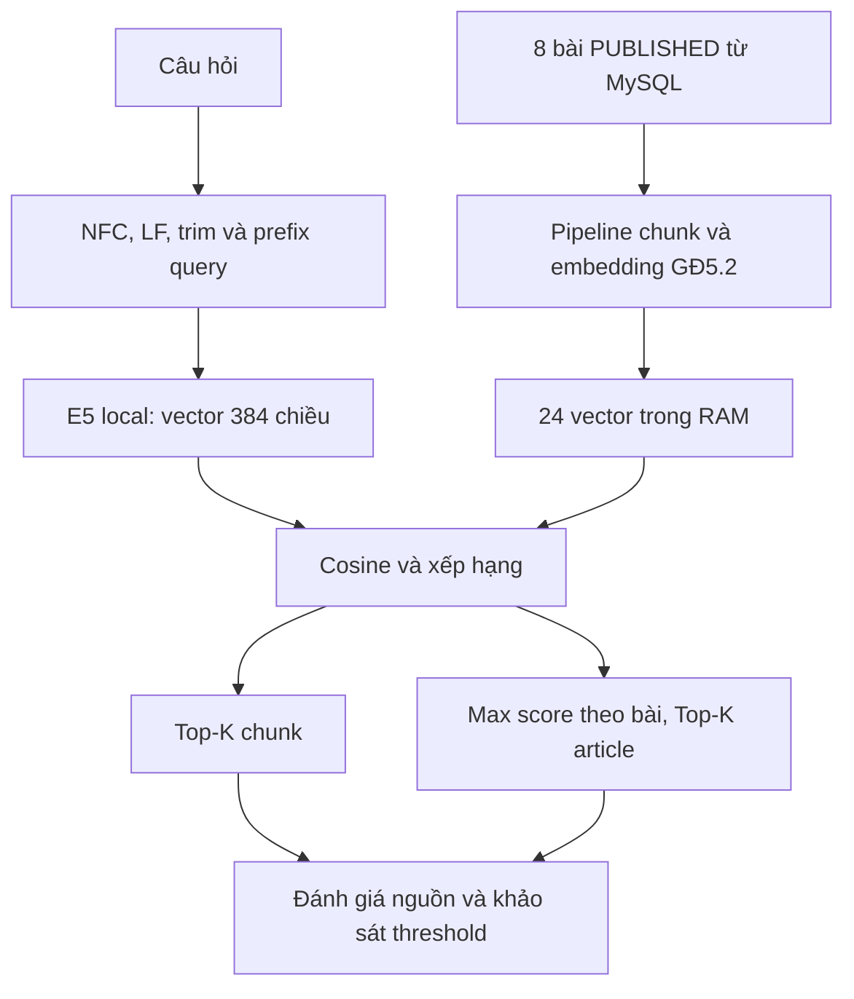

# Giai đoạn 5.3 — Vector Retrieval và đánh giá thực nghiệm

ĐÃ THỰC NGHIỆM trên code hiện tại, ngày 30/09/2026 (UTC). Nguồn số liệu: [stage5-3-results.json](stage5-3-results.json). Lượt test: `2026-09-30T07:40:07.742Z`; xác nhận CLI sau test: `2026-09-30T07:41:01.466Z`. Hai lượt có cùng ranking, similarity, metric, threshold và keyword baseline; thời gian được lưu riêng. Không thay đổi câu hỏi hoặc nhãn để cải thiện điểm.

## 1. Mục tiêu GĐ5.3

Tìm nguồn Knowledge Base liên quan bằng vector và đánh giá bằng bộ 24 câu đã chốt ở GĐ5.1. Điểm dừng là **Question → Retrieval → Top-K Sources**, chưa sinh câu trả lời.



## 2. Dữ liệu đầu vào và bảo toàn

Tái sử dụng toàn bộ năm module GĐ5.2, không viết lại hoặc sửa prefix tài liệu. Corpus thật: 8 bài PUBLISHED, 24 chunk, 3 chunk/bài; size 800 và overlap tối đa 120 Unicode code point. Không lấy DRAFT/ARCHIVED, Ticket hoặc user làm tri thức.

Nhãn chủ đề lấy từ GĐ5.1 và ánh xạ sang bài PUBLISHED theo tiêu đề duy nhất, dùng id/code thực tế. Pipeline không hard-code id 8–15; nếu tiêu đề bị thay hoặc trùng, báo lỗi để rà soát bộ nhãn, không đoán nhãn mới.

Trước/sau pipeline, sau regression và lượt CLI xác nhận: users=3, tickets=3, ticket_history=17, knowledge_articles=8; cả 8 bài vẫn PUBLISHED. So sánh sâu toàn bộ cột/dòng của 4 bảng, không chỉ đếm số lượng. Snapshot chứa dữ liệu tài khoản chỉ ở RAM để đối chiếu, không đưa vào báo cáo hoặc vector. Không tạo schema mới.

## 3. Query Embedding

Model: `Xenova/multilingual-e5-small`, model gốc `intfloat/multilingual-e5-small`, revision `761b726dd34fb83930e26aab4e9ac3899aa1fa78`, ONNX q8, CPU local, Transformers.js 4.3.0. Không dependency mới, không API key, không inference ngoài máy.

Query được chuẩn hóa bằng hàm GĐ5.2, giữ tiếng Việt và thông tin kỹ thuật, sau đó thêm `query: `. Document vẫn là `passage: <title>\n<chunk>`. Cả hai dùng cùng tokenizer/model, attention-mask mean pooling và L2. Đếm toàn bộ input và từ chối query vượt 512 token, không cắt ngầm. Vector thật có 384 chiều, số hữu hạn, norm xấp xỉ 1.

Đã đối chiếu prefix với [model card E5](https://huggingface.co/intfloat/multilingual-e5-small#usage). Implementation document GĐ5.2 đúng nên không cần sửa. Các test GĐ5.2 vẫn được chạy lại.

## 4. Cosine Similarity

So sánh chính xác query với từng vector chunk trong RAM. Điểm càng cao thì model đánh giá càng gần về biểu diễn; điểm không phải xác suất trả lời đúng. Quét vector có chi phí O(N × d), cộng O(N log N) để sort; hiện N=24, d=384 nên chưa cần vector database.

## 5. Công thức

```text
cosine(A, B) = (A · B) / (||A||₂ × ||B||₂)
```

Code tính tổng `(A[i]/normA) × (B[i]/normB)` để giảm nguy cơ overflow ở tích số lớn. Từ chối vector sai chiều, số không hữu hạn và norm 0; kẹp sai số dấu phẩy động về [-1,1]. Dù E5 đã chuẩn hóa L2 và có thể dùng dot product, implementation giữ công thức đầy đủ để dễ giải thích và kiểm tra vector chưa normalize. Test xác nhận cùng hướng ≈1, trực giao 0, đối hướng -1.

## 6. Top-K Retrieval

`retrieve({ question, vectors, embedder, k, threshold })` trả `topChunks`, `topArticles`, trạng thái chấp nhận ứng viên và timing. Mỗi nguồn có rank, similarity, articleId, code, title, status, chunkIndex, text; không trả embedding.

Sort similarity giảm dần; hòa điểm sắp articleId tăng dần rồi chunkIndex tăng dần. Rank từ 1. K phải là số nguyên dương; K lớn hơn index trả toàn bộ số nguồn có sẵn; index rỗng trả danh sách rỗng và accepted=false. Không mutate input.

Thực nghiệm K=1/3/5 lấy prefix của cùng ranking, không embed lại chỉ để đổi K. K và chính sách threshold nằm trong `retrievalConfig.js`. Mặc định threshold=null, nghĩa là chưa áp dụng ngưỡng; giá trị hiệu chỉnh được khóa trong hằng số runtime `lockedThreshold`, không rải số 0.85 trong code.

## 7. Chunk-level và article-level

**Chunk-level:** K là số chunk thô, có thể nhiều chunk cùng bài. HIT nếu ít nhất một chunk thuộc tập article kỳ vọng. JSON ghi số article phân biệt trong từng Top-K.

**Article-level:** điểm bài là **max similarity trên toàn bộ chunk của bài**; mỗi bài chỉ xuất hiện một lần, giữ chunk tốt nhất làm chứng cứ. Sau aggregation mới lấy K bài. Không khử trùng riêng Top-K chunk rồi gọi đó là Top-K article. Max đơn giản, có thể truy vết đến đúng đoạn, không tự cộng lợi thế cho bài có nhiều chunk; vẫn có thể bị chi phối bởi một đoạn khớp ngẫu nhiên.

Ví dụ A02: Top-3 chunk đều thuộc KB-000009, trong khi Top-3 article gồm ba bài khác nhau. Hai cách có cùng chỉ số tổng trong lần chạy này nhưng không phải cùng định nghĩa. Mọi bảng metric dưới đây áp dụng cho cả hai cách vì số HIT đo được bằng nhau; JSON giữ riêng hai nhánh.

## 8. Bộ 24 câu thực nghiệm

Giữ nguyên 8 DIRECT, 8 PARAPHRASE, 4 PARTIAL, 4 OUT-OF-KB từ GĐ5.1. DEV = A01–A04, B05–B08, C01–C02, D01–D02; TEST là 12 câu còn lại. Test B2 đối chiếu câu hỏi/expected/split trực tiếp với Markdown gốc.

| ID | Nhóm/tập | Câu hỏi nguyên văn | Expected code | Top-1 (similarity) | Kết quả thô |
| --- | --- | --- | --- | --- | --- |
| A01 | DIRECT/DEV | Không kết nối được Wi-Fi thì cần kiểm tra gì trước? | KB-000008 | KB-000008 (0.911878) | HIT |
| A02 | DIRECT/DEV | Máy in không in được tài liệu, tôi nên làm gì? | KB-000009 | KB-000009 (0.909451) | HIT |
| A03 | DIRECT/DEV | Quên mật khẩu tài khoản nội bộ thì xử lý thế nào? | KB-000010 | KB-000010 (0.907111) | HIT |
| A04 | DIRECT/DEV | Tôi không gửi hoặc nhận được email, cần kiểm tra gì? | KB-000011 | KB-000011 (0.900707) | HIT |
| A05 | DIRECT/TEST | Máy tính hoạt động chậm thì tôi nên kiểm tra gì? | KB-000012 | KB-000012 (0.918623) | HIT |
| A06 | DIRECT/TEST | Không truy cập được thư mục mạng nội bộ thì làm sao? | KB-000013 | KB-000013 (0.906953) | HIT |
| A07 | DIRECT/TEST | Microphone không hoạt động khi họp trực tuyến, kiểm tra thế nào? | KB-000014 | KB-000014 (0.935850) | HIT |
| A08 | DIRECT/TEST | Không truy cập được website nội bộ thì tôi cần làm gì? | KB-000015 | KB-000015 (0.895314) | HIT |
| B01 | PARAPHRASE/TEST | Biểu tượng sóng trên laptop có dấu gạch, tôi không vào mạng không dây được. | KB-000008 | KB-000008 (0.857765) | HIT |
| B02 | PARAPHRASE/TEST | Tôi bấm xuất bản giấy rồi mà lệnh cứ nằm chờ, không có tờ nào đi ra. | KB-000009 | KB-000009 (0.852565) | HIT |
| B03 | PARAPHRASE/TEST | Tôi không nhớ chuỗi bí mật để vào tài khoản công ty và đã thử sai nhiều lần. | KB-000010 | KB-000010 (0.850448) | HIT |
| B04 | PARAPHRASE/TEST | Thư đã soạn cứ nằm ở hộp đi, đồng nghiệp bảo chưa nhận được gì. | KB-000011 | KB-000011 (0.886740) | HIT |
| B05 | PARAPHRASE/DEV | Mở ứng dụng nào cũng phải đợi rất lâu, nhiều lúc máy đứng yên. | KB-000012 | KB-000009 (0.854963) | MISS |
| B06 | PARAPHRASE/DEV | Thư mục dùng chung của nhóm báo từ chối quyền dù tôi vẫn vào Internet được. | KB-000013 | KB-000013 (0.868748) | HIT |
| B07 | PARAPHRASE/DEV | Trong cuộc họp tôi nói nhưng mọi người không nghe thấy, dù tôi vẫn nghe họ. | KB-000014 | KB-000014 (0.839633) | HIT |
| B08 | PARAPHRASE/DEV | Trang làm việc của công ty cứ quay mãi không mở ra, các trang khác vẫn vào được. | KB-000015 | KB-000015 (0.883264) | HIT |
| C01 | PARTIAL/DEV | Tôi đã kết nối mạng nhưng không mở được tài nguyên của công ty. | KB-000008, KB-000013, KB-000015 | KB-000013 (0.861994) | HIT |
| C02 | PARTIAL/DEV | Máy in báo lỗi E42, tôi cần thay linh kiện nào? | KB-000009 | KB-000009 (0.857444) | HIT |
| C03 | PARTIAL/TEST | Tôi không đăng nhập được vào trang làm việc. | KB-000010, KB-000015 | KB-000015 (0.879921) | HIT |
| C04 | PARTIAL/TEST | Cần chỉnh bản ghi DNS nào để sửa lỗi thư gửi bị trả lại? | KB-000011 | KB-000011 (0.868609) | HIT |
| D01 | OUT_OF_KB/DEV | Nhân viên mới có bao nhiêu ngày nghỉ phép năm? |  | KB-000013 (0.799105) | OUT |
| D02 | OUT_OF_KB/DEV | Làm thế nào để cấu hình BGP trên router Cisco? |  | KB-000013 (0.845958) | OUT |
| D03 | OUT_OF_KB/TEST | Công ty hoàn tiền công tác theo mức nào? |  | KB-000012 (0.818829) | OUT |
| D04 | OUT_OF_KB/TEST | Hướng dẫn khôi phục database PostgreSQL bằng WAL khi mất ổ đĩa. |  | KB-000013 (0.846949) | OUT |

PARTIAL chấp nhận tập nguồn ứng viên theo nhãn gốc. C01/C03 cần hỏi rõ; C02 chỉ có hướng dẫn máy in chung, không giải mã E42; C04 chỉ có hướng dẫn email chung, không chỉ định bản ghi DNS.

## 9. Phương pháp đánh giá

Metric chính theo GĐ5.1 dùng **16 câu DIRECT+PARAPHRASE**. Metric mở rộng theo GĐ5.3 dùng **20 câu có expected source**, bao gồm PARTIAL. Không gộp 4 OUT vào mẫu số. Báo riêng DEV/TEST, từng nhóm và quyết định sau threshold.

Với tập nguồn kỳ vọng R và Top-K, HIT=1 nếu giao tập article không rỗng. Topic HIT không chứng minh đủ thông tin trả lời, đặc biệt ở PARTIAL. Các metric ranking tính trước ngưỡng; false reject tính riêng.

Có mốc đối chiếu keyword đúng phép lọc hiện tại ở frontend: `trim → toLocaleLowerCase('vi-VN') → includes` trên chuỗi `code + khoảng trắng + title`. Cả 24 câu nguyên văn đều không có kết quả theo phép lọc này. Đây chỉ là mốc full-query substring, không đại diện BM25 hoặc tìm kiếm từ khóa được tối ưu; không suy ra semantic luôn tốt hơn. Test B4 kiểm tra đúng hành vi ghép code/title.

## 10. Top-1 Accuracy

Top-1 Accuracy = số câu có nguồn đúng tại rank 1 / số câu thuộc tập đánh giá có expected.

- Chính: **15/16 = 93,75%**; DEV 7/8 = 87,5%, TEST 8/8 = 100%.
- Mở rộng: **19/20 = 95%**; DEV 9/10 = 90%, TEST 10/10 = 100%.
- B05 là MISS duy nhất tại Top-1, nguồn đúng ở hạng 2.

## 11. Hit Rate@3

Hit@3 = số câu có ít nhất một nguồn kỳ vọng trong Top-3 / số câu có expected.

Chính **16/16 = 100%** (DEV 8/8, TEST 8/8); mở rộng **20/20 = 100%** (DEV 10/10, TEST 10/10). B05 được tìm thấy khi tăng K từ 1 lên 3.

## 12. Hit Rate@5

Công thức tương tự với Top-5. Chính **16/16 = 100%**, mở rộng **20/20 = 100%**; các tập DEV/TEST đều đạt 100%. K=5 không tăng HIT so với K=3 trong corpus này, nhưng thêm nguồn ngoài kỳ vọng. Với chỉ 8 bài, Hit@5 cao không đủ chứng minh chất lượng thực tế.

Bảng sau giữ thứ tự 5 article và điểm thật. Top-1 là phần tử đầu, Top-3 là ba phần tử đầu. `True/False` là HIT với tập nguồn kỳ vọng; số nguồn phân biệt lấy từ Top-K chunk thô.

| ID | Top-5 article theo thứ tự và similarity | HIT article @1/@3/@5 | Article phân biệt trong chunk @1/@3/@5 |
| --- | --- | --- | --- |
| A01 | KB-000008: 0.911878; KB-000013: 0.892977; KB-000015: 0.877093; KB-000011: 0.866227; KB-000010: 0.864570 | True/True/True | 1/2/3 |
| A02 | KB-000009: 0.909451; KB-000013: 0.858219; KB-000012: 0.856557; KB-000008: 0.852918; KB-000015: 0.845742 | True/True/True | 1/1/3 |
| A03 | KB-000010: 0.907111; KB-000013: 0.878069; KB-000015: 0.861209; KB-000011: 0.844929; KB-000008: 0.831851 | True/True/True | 1/1/3 |
| A04 | KB-000011: 0.900707; KB-000015: 0.870026; KB-000013: 0.869292; KB-000010: 0.865441; KB-000009: 0.859633 | True/True/True | 1/2/4 |
| A05 | KB-000012: 0.918623; KB-000009: 0.871836; KB-000013: 0.867777; KB-000008: 0.866007; KB-000015: 0.856767 | True/True/True | 1/1/3 |
| A06 | KB-000013: 0.906953; KB-000015: 0.884495; KB-000010: 0.862695; KB-000011: 0.853406; KB-000008: 0.850358 | True/True/True | 1/1/2 |
| A07 | KB-000014: 0.935850; KB-000013: 0.854678; KB-000008: 0.852530; KB-000010: 0.850847; KB-000012: 0.842210 | True/True/True | 1/1/3 |
| A08 | KB-000015: 0.895314; KB-000013: 0.894212; KB-000010: 0.866965; KB-000008: 0.852993; KB-000011: 0.852945 | True/True/True | 1/2/2 |
| B01 | KB-000008: 0.857765; KB-000013: 0.854876; KB-000015: 0.847999; KB-000009: 0.843099; KB-000010: 0.839236 | True/True/True | 1/2/2 |
| B02 | KB-000009: 0.852565; KB-000012: 0.845379; KB-000015: 0.839615; KB-000011: 0.839551; KB-000013: 0.834321 | True/True/True | 1/2/3 |
| B03 | KB-000010: 0.850448; KB-000015: 0.847351; KB-000013: 0.843602; KB-000012: 0.839743; KB-000008: 0.838949 | True/True/True | 1/2/2 |
| B04 | KB-000011: 0.886740; KB-000013: 0.850812; KB-000009: 0.841655; KB-000012: 0.830621; KB-000015: 0.829391 | True/True/True | 1/2/2 |
| B05 | KB-000009: 0.854963; KB-000012: 0.852831; KB-000014: 0.846243; KB-000010: 0.839764; KB-000008: 0.838326 | False/True/True | 1/2/2 |
| B06 | KB-000013: 0.868748; KB-000011: 0.857347; KB-000015: 0.843482; KB-000009: 0.842018; KB-000010: 0.830195 | True/True/True | 1/2/3 |
| B07 | KB-000014: 0.839633; KB-000011: 0.815126; KB-000013: 0.806523; KB-000008: 0.804221; KB-000009: 0.804177 | True/True/True | 1/1/2 |
| B08 | KB-000015: 0.883264; KB-000013: 0.864603; KB-000010: 0.858126; KB-000008: 0.854322; KB-000012: 0.848400 | True/True/True | 1/2/4 |
| C01 | KB-000013: 0.861994; KB-000008: 0.852367; KB-000009: 0.836590; KB-000015: 0.836581; KB-000010: 0.832846 | True/True/True | 1/2/2 |
| C02 | KB-000009: 0.857444; KB-000013: 0.845337; KB-000008: 0.836936; KB-000010: 0.831580; KB-000015: 0.826641 | True/True/True | 1/1/3 |
| C03 | KB-000015: 0.879921; KB-000013: 0.862472; KB-000008: 0.852491; KB-000010: 0.852276; KB-000012: 0.846111 | True/True/True | 1/2/3 |
| C04 | KB-000011: 0.868609; KB-000013: 0.858146; KB-000015: 0.841308; KB-000010: 0.836180; KB-000009: 0.834357 | True/True/True | 1/2/3 |
| D01 | KB-000013: 0.799105; KB-000015: 0.794952; KB-000010: 0.793226; KB-000011: 0.792638; KB-000009: 0.777683 | N/A | 1/3/4 |
| D02 | KB-000013: 0.845958; KB-000015: 0.826187; KB-000008: 0.824452; KB-000010: 0.822991; KB-000011: 0.815461 | N/A | 1/3/4 |
| D03 | KB-000012: 0.818829; KB-000013: 0.816465; KB-000015: 0.812087; KB-000010: 0.802632; KB-000011: 0.801692 | N/A | 1/2/3 |
| D04 | KB-000013: 0.846949; KB-000010: 0.845610; KB-000015: 0.835662; KB-000012: 0.834695; KB-000011: 0.832874 | N/A | 1/3/5 |

## 13. Kết quả theo nhóm

| Nhóm | Top-1 | Hit@3 | Hit@5 |
| --- | --- | --- | --- |
| DIRECT | 8/8 = 100% | 8/8 = 100% | 8/8 = 100% |
| PARAPHRASE | 7/8 = 87,5% | 8/8 = 100% | 8/8 = 100% |
| PARTIAL (chỉ đúng chủ đề ứng viên) | 4/4 = 100% | 4/4 = 100% | 4/4 = 100% |

DEV: DIRECT 4/4, PARAPHRASE 3/4, PARTIAL 2/2 Top-1. TEST: DIRECT 4/4, PARAPHRASE 4/4, PARTIAL 2/2 Top-1. Chỉ có 8 câu chính trong mỗi tập; một câu làm thay đổi accuracy 12,5 điểm phần trăm.

## 14. OUT-OF-KB

Nearest neighbor luôn tồn tại khi index không rỗng, nhưng không có nghĩa nguồn đó trả lời được câu hỏi. Theo nhãn gốc, cả 4 câu D đều cần reject khi chọn căn cứ trả lời.

| ID | Top-1 | Similarity | Top-3 article | Quyết định ở ngưỡng đã khóa |
| --- | --- | --- | --- | --- |
| D01 | KB-000013 | 0.799105 | KB-000013: 0.799105; KB-000015: 0.794952; KB-000010: 0.793226 | REJECT đúng |
| D02 | KB-000013 | 0.845958 | KB-000013: 0.845958; KB-000015: 0.826187; KB-000008: 0.824452 | REJECT đúng |
| D03 | KB-000012 | 0.818829 | KB-000012: 0.818829; KB-000013: 0.816465; KB-000015: 0.812087 | REJECT đúng |
| D04 | KB-000013 | 0.846949 | KB-000013: 0.846949; KB-000010: 0.845610; KB-000015: 0.835662 | REJECT đúng |

Ở ngưỡng đã chọn: **4/4 reject đúng, 0/4 false positive OUT**. DEV 2/2 và TEST 2/2. Không dùng kết quả này làm bằng chứng rằng hệ thống tự hiểu mọi câu ngoài KB.

## 15. Phân bố similarity

Điểm Top-1 article của từng nhóm, lấy trực tiếp từ model:

| Nhóm | Min | Max | Trung bình |
| --- | --- | --- | --- |
| DIRECT | 0.895314 | 0.935850 | 0.910736 |
| PARAPHRASE | 0.839633 | 0.886740 | 0.861766 |
| PARTIAL | 0.857444 | 0.879921 | 0.866992 |
| OUT_OF_KB | 0.799105 | 0.846949 | 0.827710 |

PARAPHRASE và OUT chồng lấn: B07 đúng nguồn nhưng điểm 0.839633 thấp hơn D02 (0.845958) và D04 (0.846949). Không có một ngưỡng đơn giản vừa giữ toàn bộ câu có nguồn vừa loại hết OUT trong mẫu này. E5 cũng ghi nhận điểm cosine thường tập trung ở miền cao; điểm tuyệt đối không phải xác suất. [FAQ của model E5](https://huggingface.co/intfloat/multilingual-e5-small#faq).

## 16. Thực nghiệm threshold

Chỉ dùng điểm **12 câu DEV** để tạo ứng viên: trung điểm giữa các Top-1 score khác nhau đã sắp xếp, cộng hai biên -1 và 1 làm đối chứng accept/reject cực trị. Chọn giá trị tối đa hóa balanced accuracy `(tỷ lệ IN accepted + tỷ lệ OUT rejected)/2`; hòa thì ưu tiên ít OUT false positive hơn, sau đó ngưỡng thấp hơn. IN ở phép khảo sát này gồm 10 câu DEV có expected (8 A/B và 2 PARTIAL), mang nghĩa có ứng viên nguồn, không phải đủ bằng chứng trả lời.

Khóa **threshold = 0.8504602347669256** trước khi embed/đánh giá TEST. Không làm tròn thành 0.850 để ra quyết định: B03 có điểm 0.8504481365254487 rất gần biên và vẫn bị reject ở giá trị đầy đủ. Bảng TEST/ALL dưới đây là mô tả sau khi khóa, không dùng chọn lại threshold.

Mỗi ô là **IN accepted / IN reject sai / OUT reject đúng / OUT accept sai**.

| Threshold (hiển thị 6 số lẻ) | DEV (10 IN, 2 OUT) | TEST (10 IN, 2 OUT) | ALL (20 IN, 4 OUT) |
| --- | --- | --- | --- |
| -1.000000 | 10/0/0/2 | 10/0/0/2 | 20/0/0/4 |
| 0.819369 | 10/0/1/1 | 10/0/1/1 | 20/0/2/2 |
| 0.842795 | 9/1/1/1 | 10/0/1/1 | 19/1/2/2 |
| 0.850460 | 9/1/2/0 | 9/1/2/0 | 18/2/4/0 |
| 0.856203 | 8/2/2/0 | 8/2/2/0 | 16/4/4/0 |
| 0.859719 | 7/3/2/0 | 7/3/2/0 | 14/6/4/0 |
| 0.865371 | 6/4/2/0 | 7/3/2/0 | 13/7/4/0 |
| 0.876006 | 5/5/2/0 | 6/4/2/0 | 11/9/4/0 |
| 0.891986 | 4/6/2/0 | 4/6/2/0 | 8/12/4/0 |
| 0.903909 | 3/7/2/0 | 3/7/2/0 | 6/14/4/0 |
| 0.908281 | 2/8/2/0 | 2/8/2/0 | 4/16/4/0 |
| 0.910665 | 1/9/2/0 | 2/8/2/0 | 3/17/4/0 |
| 1.000000 | 0/10/2/0 | 0/10/2/0 | 0/20/4/0 |

Ngưỡng khóa: DEV giữ 9/10 IN, reject sai B07; TEST giữ 9/10 IN, reject sai B03. Tổng giữ 18/20 IN (90%), reject sai **2/20 (10%)**, OUT false positive **0/4**. Trong 18 IN được accept, 17 đúng Top-1 và **B05 vẫn accept nguồn sai**; lỗi này khác false positive ngoài KB và được giữ riêng. Nhóm PARTIAL cả 4 được accept làm ứng viên nhưng không được coi là có thể trả lời đầy đủ.

Trong phạm vi dữ liệu hiện tại, đây là một ngưỡng thăm dò giảm nhận nhầm OUT và chấp nhận đánh đổi độ phủ. Không gọi là tối ưu cho hệ thống thực tế; không cài nó thành threshold production mặc định. Nhánh dữ liệu TEST không tham gia calibration và câu hỏi/nhãn không đổi sau khi xem lỗi.

## 17. Thời gian retrieval

Model load một lần, tạo 24 document vector trước truy vấn; warm-up một query A01 thuộc DEV, không tính vào số đo. Mỗi câu chạy 3 lượt đo (72 lượt cho 24 câu), assert ranking/score giống nhau giữa ba lượt. Mỗi câu lưu đủ 3 timing, min/max/average/median. Tất cả là ms.

Bảng **lượt CLI mới nhất**: min/max trên 24 giá trị trung bình mỗi câu; average là trung bình chung của 72 lượt (mỗi câu cùng 3 lượt). Min/max từng lượt riêng nằm trong `cliVerification.timing.all72Measurements`.

| Bước | Min trung bình/câu | Max trung bình/câu | Average |
| --- | --- | --- | --- |
| queryEmbeddingMs | 3.049067 | 5.306900 | 4.176989 |
| searchMs | 0.347767 | 0.743400 | 0.582254 |
| totalMs | 3.638300 | 6.370067 | 5.076425 |

CLI load model từ cache: **1504.755900 ms**; chuẩn bị corpus: **398.054000 ms**, đều tách khỏi từng query. Lượt test trước CLI có trung bình embedding/search/total: **3.950678 / 0.603301 / 4.858461 ms**. Độ trễ thay đổi theo tải máy/cache; ranking và metric không đổi. Môi trường Windows x64, Node v22.17.1, CPU Intel i7-11800H 2.30 GHz, RAM khoảng 7,71 GiB.

`queryEmbeddingMs` gồm gọi model và validation vector. `searchMs` gồm validation chunk, cosine, sort, aggregation, chọn Top-K. `totalMs` còn gồm preprocessing/token count/điều phối nên lớn hơn tổng hai phần. Không tính load model, chuẩn bị corpus, calibration/metric, snapshot MySQL hoặc ghi JSON vào latency từng query. Chưa đo p95 production hoặc tải đồng thời.

## 18. Minh chứng retrieval đúng và các nhóm

Các ví dụ dùng Top-3 **article** từ lượt chạy thật; JSON đồng thời giữ Top-5 chunk đầy đủ text để truy vết.

### A01 — DIRECT

Câu hỏi: Không kết nối được Wi-Fi thì cần kiểm tra gì trước?

Expected: KB-000008.

- Top-1: **KB-000008 — Không kết nối được Wi-Fi**, similarity = 0.911878, chunk_index = 1.
- Top-2: **KB-000013 — Không truy cập được thư mục mạng nội bộ**, similarity = 0.892977, chunk_index = 1.
- Top-3: **KB-000015 — Không truy cập được website nội bộ**, similarity = 0.877093, chunk_index = 1.

Kết quả: HIT Top-1; quyết định ngưỡng: ACCEPT_SOURCE_CANDIDATE.

### B04 — PARAPHRASE

Câu hỏi: Thư đã soạn cứ nằm ở hộp đi, đồng nghiệp bảo chưa nhận được gì.

Expected: KB-000011.

- Top-1: **KB-000011 — Không gửi hoặc nhận được email**, similarity = 0.886740, chunk_index = 0.
- Top-2: **KB-000013 — Không truy cập được thư mục mạng nội bộ**, similarity = 0.850812, chunk_index = 2.
- Top-3: **KB-000009 — Máy in không in được tài liệu**, similarity = 0.841655, chunk_index = 0.

Kết quả: HIT Top-1; quyết định ngưỡng: ACCEPT_SOURCE_CANDIDATE.

### C04 — PARTIAL

Câu hỏi: Cần chỉnh bản ghi DNS nào để sửa lỗi thư gửi bị trả lại?

Expected: KB-000011.

- Top-1: **KB-000011 — Không gửi hoặc nhận được email**, similarity = 0.868609, chunk_index = 1.
- Top-2: **KB-000013 — Không truy cập được thư mục mạng nội bộ**, similarity = 0.858146, chunk_index = 1.
- Top-3: **KB-000015 — Không truy cập được website nội bộ**, similarity = 0.841308, chunk_index = 1.

Kết quả: HIT Top-1; quyết định ngưỡng: ACCEPT_SOURCE_CANDIDATE.

### D04 — OUT_OF_KB

Câu hỏi: Hướng dẫn khôi phục database PostgreSQL bằng WAL khi mất ổ đĩa.

Expected: không có nguồn phù hợp.

- Top-1: **KB-000013 — Không truy cập được thư mục mạng nội bộ**, similarity = 0.846949, chunk_index = 1.
- Top-2: **KB-000010 — Quên mật khẩu tài khoản nội bộ**, similarity = 0.845610, chunk_index = 1.
- Top-3: **KB-000015 — Không truy cập được website nội bộ**, similarity = 0.835662, chunk_index = 1.

Kết quả: OUT-OF-KB, không có HIT ngữ nghĩa hợp lệ; quyết định ngưỡng: REJECT_SOURCE.

### B05 — PARAPHRASE

Câu hỏi: Mở ứng dụng nào cũng phải đợi rất lâu, nhiều lúc máy đứng yên.

Expected: KB-000012.

- Top-1: **KB-000009 — Máy in không in được tài liệu**, similarity = 0.854963, chunk_index = 1.
- Top-2: **KB-000012 — Máy tính hoạt động chậm**, similarity = 0.852831, chunk_index = 1.
- Top-3: **KB-000014 — Microphone không hoạt động khi họp trực tuyến**, similarity = 0.846243, chunk_index = 2.

Kết quả: MISS Top-1, HIT Top-3/5; quyết định ngưỡng: ACCEPT_SOURCE_CANDIDATE.

C04 HIT chỉ chứng minh tìm đúng bài email nói chung. Nguồn không chứa bản ghi DNS cần chỉnh; không được biến kết quả đó thành hướng dẫn cấu hình. D04 bị reject dù có nearest neighbor khá cao.

## 19. Các trường hợp sai được giữ nguyên

| Trường hợp | Expected | Output | Hậu quả |
| --- | --- | --- | --- |
| B05 — Mở ứng dụng nào cũng phải đợi rất lâu, nhiều lúc máy đứng yên. | KB-000012, máy tính chậm | Top-1 KB-000009 máy in: 0.8549629575; nguồn đúng hạng 2: 0.8528305462 | MISS Top-1, HIT@3/@5; ngưỡng vẫn accept nguồn sai |
| B03 — Không nhớ chuỗi bí mật để vào tài khoản công ty | KB-000010 | Top-1 đúng, score 0.8504481365 < threshold 0.8504602348 | False reject trên TEST |
| B07 — Nói trong cuộc họp nhưng người khác không nghe | KB-000014 | Top-1 đúng, score 0.8396333838 | False reject trên DEV |

Không có MISS khác ở Top-1 trên bộ 20 câu có expected, và không có MISS@3/@5 trong lần chạy này. Không sửa B05, expected hoặc nội dung bài để tăng điểm. Test logic PASS không có nghĩa retrieval ngữ nghĩa luôn đúng.

## 20. Phân tích nguyên nhân và sửa lỗi kỹ thuật

Suy luận từ nguồn: chunk máy in đứng đầu B05 có câu “Nếu chỉ một ứng dụng gặp lỗi ... đóng và mở lại ứng dụng”, đồng thời corpus nhiều hướng dẫn lặp về máy tính/ứng dụng. Chênh lệch với bài máy chậm chỉ khoảng 0.00213 nên model chọn nhầm là quan sát cần nghiên cứu; chưa chứng minh nguyên nhân bằng ablation. B07 diễn đạt gián tiếp, vẫn đúng thứ tự nguồn nhưng score tuyệt đối thấp; threshold toàn cục làm mất câu đúng. B03 sát biên khoảng 0.0000121 nên dễ đổi quyết định nếu làm tròn hoặc đổi runtime.

PARTIAL cho thấy hạn chế lớn hơn ranking: đúng chủ đề không giải mã E42 hoặc cung cấp cấu hình DNS. Quyết định `ACCEPT_SOURCE_CANDIDATE` chỉ là chấp nhận ứng viên dựa trên score; chưa có bộ kiểm tra đủ bằng chứng để trả lời.

Trong quá trình triển khai, đã sửa lỗi parser giữ phần chú thích “chỉ liên quan chung” trong nhãn C04; expected đúng vẫn là email theo GĐ5.1. Đã sửa keyword baseline cho đúng phép includes trên chuỗi code + title và bổ sung test B4. Đây là sửa lỗi kỹ thuật, không đổi câu hỏi/nhãn để khớp output. Lượt chạy ngày 30/09 xác nhận metric/ranking/threshold không thay đổi so với kết quả trước gián đoạn; timing mới được ghi riêng.

## 21. Kiểm thử, hồi quy và giới hạn

### Test GĐ5.3

**17/17 test yêu cầu và 4/4 test bổ sung PASS**. Fixture chỉ dùng cho kiểm tra toán học/nhánh logic; experiment dùng model, MySQL và 24 câu thật. Test runner còn tính lại tử số/mẫu số từ nguồn Top-K để đối chiếu metric báo cáo.

| Test | Nội dung | Cách kiểm tra | Kết quả |
| --- | --- | --- | --- |
| 1 | Query thật có 384 chiều | model và MySQL thật | PASS |
| 2 | Query thật và cosine không NaN | model và MySQL thật | PASS |
| 3 | Query thật và cosine không Infinity | model và MySQL thật | PASS |
| 4 | Cosine với chính nó gần 1; trực giao 0; đối hướng -1; vector chưa L2 | logic fixture | PASS |
| 5 | Ranking giảm dần | logic fixture | PASS |
| 6 | Top-K đủ số lượng khi đủ chunk | logic fixture | PASS |
| 7 | K lớn hơn index và index rỗng xử lý an toàn | logic fixture | PASS |
| 8 | K không phải số nguyên dương bị từ chối | logic fixture | PASS |
| 9 | Câu hỏi rỗng hoặc sai kiểu bị từ chối | logic fixture | PASS |
| 10 | Metadata nguồn nguyên vẹn; không trả embedding | logic fixture | PASS |
| 11 | Rank bắt đầu 1 và liên tiếp | logic fixture | PASS |
| 12 | Tie deterministic theo articleId/chunkIndex, độc lập thứ tự input | logic fixture | PASS |
| 13 | Aggregation max toàn index; chunk trùng không chiếm chỗ article | logic fixture | PASS |
| 14 | Threshold bao gồm biên bằng ngưỡng và validation | logic fixture | PASS |
| 15 | Retrieval không sửa input vectors | logic fixture | PASS |
| 16 | Giữ tiếng Việt NFC và prefix query chính xác | logic fixture | PASS |
| 17 | Pipeline giữ nguyên mọi dữ liệu của 4 bảng | model và MySQL thật | PASS |
| B1 | Chặn vector sai/zero/nonfinite và query quá ngân sách | logic fixture | PASS |
| B2 | 24 câu/nhãn/split giữ đúng Markdown GĐ5.1 | logic fixture | PASS |
| B3 | Metric không gộp OUT; chọn threshold chỉ DEV, đếm FP/FN đúng | logic fixture | PASS |
| B4 | Keyword baseline giữ phép includes trên code + title như frontend | logic fixture | PASS |

### Regression

`npm run test:stage5-3` gọi nguyên bộ GĐ5.2 sau khi kiểm tra retrieval, sau đó GĐ5.2 gọi các suite API hiện có. Không cần chạy lặp từng bộ lần nữa khi tất cả đã PASS trong cùng lượt:

| Bộ | Kết quả |
| --- | --- |
| GĐ5.2 | 17 yêu cầu + 2 bổ sung + 8 logic = 27/27 PASS |
| Auth/JWT/RBAC/users/health/MySQL | 23/23 PASS |
| Ticket/history/workflow/transaction | 30/30 PASS |
| Knowledge Base API/quyền/status | 30/30 PASS |

Tổng regression API nghiệp vụ 83/83 PASS. Các suite cũ tạo/thay đổi dữ liệu tạm rồi khôi phục; pipeline retrieval chỉ SELECT. Báo cáo GĐ5.2 và các báo cáo cũ được khôi phục nguyên byte. Snapshot trước/sau xác nhận 3/3/17/8 và dữ liệu nguyên vẹn; AUTO_INCREMENT có thể tăng do test tạo/dọn bản ghi tạm, không reset. CLI chạy sau test cũng so sánh dữ liệu trước/sau và PASS.

Frontend không thay đổi nên không build hoặc tuyên bố đã kiểm thử giao diện ở GĐ5.3. Không dùng suite GĐ4.5 có assertion yêu cầu chưa có embedding; các API nghiệp vụ đã được hồi quy qua suite phù hợp.

### Hạn chế

- Chỉ 8 bài demo và 24 câu; DEV/TEST có câu gần nghĩa, không phải benchmark độc lập lớn. TEST chỉ 2 OUT; mỗi lỗi làm tỷ lệ OUT thay đổi 50 điểm phần trăm.
- Full-query substring baseline yếu với câu dài; chưa so BM25, hybrid hoặc reranker. Chưa thực nghiệm biến thể toàn bài/fixed-size/chunk size mới để giải thích nguyên nhân.
- Max aggregation có thể bị đoạn khớp ngẫu nhiên chi phối; overlap/boilerplate và lặp title vẫn giữ như GĐ5.2.
- Vector/index chỉ trong RAM, quét toàn bộ; chưa có persistence, index lớn, incremental update hoặc cơ chế làm mới đồng thời khi KB thay đổi. Cần chạy lại sau khi bài sửa/status đổi; script dùng database demo ổn định khi đo.
- Threshold không phát hiện đủ-bằng-chứng; B05, B03, B07 và PARTIAL chứng minh còn lỗi. Không đưa ngưỡng này vào vận hành thực tế.
- Bài có title đổi/trùng sẽ cần rà soát mapping nhãn. Query quá dài bị từ chối, chưa có UI hỗ trợ rút gọn.
- Test đầy đủ yêu cầu đúng mốc demo 3/3/17/8; nếu người dùng thêm dữ liệu hợp lệ thì dừng và báo, không tự xóa để khớp số lượng.

## 22. Đề xuất cho GĐ5.4 — CHƯA TRIỂN KHAI

Chờ yêu cầu mới. Có thể mở rộng câu paraphrase/OUT gần CNTT, kiểm chứng nhãn độc lập và thêm tập kiểm tra chưa dùng hiệu chỉnh. Cần xử lý thiếu bằng chứng cho PARTIAL, khảo sát chênh lệch top score, biến thể chunking hoặc hybrid/reranker bằng experiment riêng, và thiết kế làm mới nguồn khi KB đổi trạng thái. Các ý này là đề xuất, không phải chức năng đã có; chưa chọn hoặc gọi LLM.

## 23. File, cách tái tạo và điểm dừng

| File | Trạng thái / trách nhiệm |
| --- | --- |
| `backend/src/rag/retrieval.js` | Mới: query prefix, cosine, ranking, aggregation, Top-K |
| `backend/src/rag/retrievalConfig.js` | Mới: K, threshold mặc định và policy hiệu chỉnh |
| `backend/src/rag/retrievalEvaluation.js` | Mới: nhãn, keyword baseline, metric, khảo sát ngưỡng |
| `backend/src/rag/retrievalExperiment.js` | Mới: corpus thật, DEV trước TEST, đo timing, CLI |
| `backend/src/rag/retrievalQuestions.json` | Mới: nguyên 24 câu và nhãn GĐ5.1 |
| `backend/tests/stage5-3-logic.cjs` | Mới: test logic, đối chiếu câu hỏi và keyword baseline |
| `backend/tests/stage5-3-experiment.cjs` | Mới: integration và regression |
| `docs/stage5-3-results.json` | Mới: số liệu thật, nguồn, metric, lỗi, test và CLI verification |
| `docs/giai-doan-5-3.md` | Mới: báo cáo này |
| `backend/package.json` | Sửa: thêm 2 npm scripts; không thêm dependency |

Từ thư mục backend với cấu hình MySQL local hiện có:

```powershell
node tests/stage5-3-logic.cjs
npm.cmd run test:stage5-3
npm.cmd run experiment:retrieval
```

Test ghi `docs/stage5-3-results.json`, đã chứa experiment thật và regression. CLI ghi riêng `backend/.cache/rag/retrieval-summary.json` (Git ignore). Báo cáo commit đính kèm `cliVerification` từ lượt CLI sau test, sau khi assert ranking/metric/threshold/baseline trùng nhau. Chạy test lại sẽ tái tạo phần báo cáo test; muốn cập nhật minh chứng CLI cần đối chiếu và đính kèm lượt CLI tương ứng, không gán timing từ hai lượt thành một.

Không sửa frontend, Auth/RBAC, Ticket workflow, Knowledge Base API, schema hay năm module GĐ5.2. Không thêm Qdrant/vector DB, API /ask, LLM, prompt generation, chatbot hoặc tự tạo Ticket bằng AI. Git loại cache model và không đưa secret/.env/node_modules/dist/vector dump vào commit.

Giai đoạn 5.3 đã hoàn thành ở mức Vector Retrieval và đánh giá thực nghiệm.
Chưa triển khai LLM hoặc chatbot.

Dừng tại GĐ5.3; chưa bắt đầu GĐ5.4.
