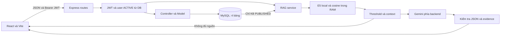

# Giai đoạn 6.1 – Rà soát hệ thống và baseline hoàn thiện

## 1. Mục tiêu

Ghi lại trạng thái triển khai thực tế sau GĐ5.6, kiểm tra hồi quy trước khi hoàn thiện E2E. Nguồn chính là code và schema MySQL thật, đối chiếu tài liệu theo thời điểm. Bằng chứng máy đọc: [stage6-1-results.json](stage6-1-results.json); thời gian chạy UTC nằm trong testedAt.

## 2. Phạm vi

Chỉ rà soát và tạo ba tài liệu GĐ6.1. Không sửa code nghiệp vụ, frontend, schema, dependency, README, prompt, threshold, model hoặc kết quả thực nghiệm cũ. Không triển khai GĐ6.2/6.3. Chạy lại suite hiện có, dùng mock provider; **0 request Gemini thật**.

Đọc schema/dữ liệu bằng SELECT. Các suite hồi quy cũ tự tạo/dọn dữ liệu test; suite Auth tạm đổi status demo rồi phục hồi và wrapper khôi phục timestamp. Đây không phải phiên kiểm thử chỉ đọc hoàn toàn. Không sửa/xóa dữ liệu gốc để ép số lượng; toàn bộ snapshot trước/sau được so sánh trong bộ nhớ, không lưu dump/hash mật khẩu. AUTO_INCREMENT có thể tiến do bản ghi test; không reset.

## 3. Trạng thái Git ban đầu

Đã chạy git status, git status -sb, git log -10 --oneline, git rev-parse HEAD và git rev-parse origin/main. Branch main, working tree sạch, HEAD = origin/main = **c4dda25c86fd7d9773be3294ff2d5b63e04c31d3**. Message: **docs: finalize RAG evaluation and evidence**. Không giả định từ prompt. Chỉ stage ba file mới sau review; commit dự kiến: docs: add system audit and E2E baseline.

## 4. Cấu trúc hệ thống

Inventory chính xác theo Git được lưu trong JSON, bỏ node_modules/dist/cache/.git. Backend/src có 43 file không tính .gitkeep, frontend/src 7 file, backend/tests 19 file.

| Khu vực | Hiện có |
| --- | --- |
| backend/src/config | db, env, jwt |
| models / controllers | User, Ticket, KnowledgeArticle; controller Auth và Health |
| middleware | authenticate, role, error; không dựa quyền UI |
| routes | health, auth, users, test RBAC, tickets, knowledge, rag; cả 7 đều mount |
| utils | validation, seedUsers, seedKnowledge, knowledgeSeedData |
| rag | config/text/embedding/pipeline/experiment; retrieval/config/evaluation/experiment/questions; generation config/context/prompt/client/output/safety/service |
| backend/tests | API/browser GĐ2–4, seed, regression, logic/experiment GĐ5.2–5.4, browser/regression GĐ5.5 |
| frontend/src | main.jsx, App.jsx, Tickets.jsx, KnowledgeBase.jsx, RagAssistant.jsx, api.js, style.css |
| database | 01_create_database.sql, 02_create_users.sql, 03_create_tickets.sql, 04_create_knowledge_base.sql |
| docs | GĐ2, GĐ3, GĐ4.2–4.5, GĐ5.1–5.6, minh chứng GĐ5, JSON kết quả và hai PNG lịch sử |

Không có tài liệu GĐ1 hoặc GĐ4.1 riêng trong docs; nội dung khởi tạo/schema nằm trong README và SQL. services/.gitkeep là thư mục dự phòng, không phải module nghiệp vụ đang chạy.

## 5. Kiến trúc tổng thể



Không có bảng vectors/chunks/chat, vector DB, backend chat memory, streaming hoặc tự động tạo Ticket. Frontend không gọi Gemini trực tiếp. Cấu hình và key chỉ nạp runtime ở backend.

## 6. Database

Đối chiếu cả bốn SQL và information_schema.TABLES/COLUMNS/KEY_COLUMN_USAGE/REFERENTIAL_CONSTRAINTS. DB thật đúng bốn bảng, tất cả InnoDB, utf8mb4_unicode_ci. Cột, mặc định, key và sáu FK chi tiết nằm trong JSON, không có dữ liệu user nhạy cảm.

| Bảng | PK / UNIQUE | Trường nghiệp vụ và mặc định | Quan hệ |
| --- | --- | --- | --- |
| users | id INT AUTO_INCREMENT; email VARCHAR(254) UNIQUE | name VARCHAR(100), password VARCHAR(255); role EMPLOYEE/IT/ADMIN mặc định EMPLOYEE; status ACTIVE/INACTIVE mặc định ACTIVE | Một user tạo nhiều Ticket/KB, nhận Ticket, ghi history |
| tickets | id INT AUTO_INCREMENT; code VARCHAR(32) UNIQUE | title VARCHAR(255), description TEXT; priority LOW/MEDIUM/HIGH mặc định LOW; status NEW/RECEIVED/IN_PROGRESS/RESOLVED/CLOSED mặc định NEW; solution TEXT nullable | created_by NOT NULL → users.id; assigned_to nullable → users.id |
| ticket_history | id INT AUTO_INCREMENT | old_status nullable, new_status bắt buộc với cùng 5 trạng thái; note TEXT nullable | ticket_id → tickets.id; actor_id → users.id, đều NOT NULL |
| knowledge_articles | id INT AUTO_INCREMENT; code VARCHAR(32) UNIQUE | title VARCHAR(255), content TEXT NOT NULL; status DRAFT/PUBLISHED/ARCHIVED mặc định DRAFT | created_by NOT NULL và updated_by nullable → users.id |

Cả sáu FK ON DELETE RESTRICT và ON UPDATE RESTRICT. created_at mặc định CURRENT_TIMESTAMP; users/tickets/knowledge_articles có updated_at tự cập nhật. ticket_history chỉ có created_at. Không tạo/sửa bảng hoặc chạy migration.

## 7. Authentication

Login chuẩn hóa email, validate password, bcrypt.compare và ACTIVE; sai thông tin/inactive trả 401. JWT HS256, sub là ID, có exp; mặc định thời hạn 1d nếu không cấu hình khác. JWT secret kiểm tra độ dài tối thiểu 32 ký tự. authenticate kiểm tra Bearer, signature/expiry/sub và đọc user từ DB mỗi request; token cũ mất quyền ngay khi role/status đổi. /auth/me trả thông tin an toàn, không password/hash.

Frontend giữ token sessionStorage theo tab, reload gọi /auth/me, kiểm tra lại khi focus và mỗi phút. Logout xóa token/state phía browser; chưa thu hồi token server. Test hiện có xác minh token thiếu/sai/hết hạn/sai chữ ký, INACTIVE cả login và token đã cấp.

## 8. RBAC

Backend là nơi quyết định quyền: middleware chặn theo role; model Ticket/KB bổ sung điều kiện bản ghi. Không có cơ chế ADMIN tự động vượt mọi route: POST /tickets vẫn chỉ EMPLOYEE. Thay đổi role từ DB có hiệu lực request kế tiếp. UI ẩn/hiện phù hợp vai trò nhưng không thay thế backend.

## 9. User management

ADMIN có GET/POST users và PATCH role/status; chưa có UI quản trị riêng. Tạo user hash bcrypt cost 12, kiểm tra email trùng, role/status hợp lệ, password tối thiểu 8 ký tự và tối đa 72 byte UTF-8. Model dùng placeholder; response chỉ thông tin an toàn. Ba user demo đều ACTIVE, bcrypt cost 12 và compare thành công trong baseline.

Chưa có bảo vệ ADMIN ACTIVE cuối cùng ở changeRole/changeStatus (P2-04); chỉ ghi nhận tĩnh, không thử khóa ADMIN thật. Không bổ sung quy tắc nghiệp vụ trong GĐ6.1.

## 10. Ticket

**EMPLOYEE gửi yêu cầu hỗ trợ bằng cách tạo Ticket.** Body tạo chỉ title/description; created_by lấy từ phiên, priority LOW/status NEW do backend/DB, code TKT- từ insertId. EMPLOYEE chỉ list/detail của mình; truy cập ID của người khác bị 403. IT/ADMIN xem tất cả.

Workflow thật:

```text
NEW → RECEIVED → IN_PROGRESS → RESOLVED → CLOSED
RESOLVED → IN_PROGRESS (xử lý lại)
```

CLOSED là trạng thái cuối; không có CLOSED → IN_PROGRESS.

Tiếp nhận qua /accept, chỉ NEW; assigned_to là người tiếp nhận IT hoặc ADMIN, không nhận ID tùy ý. Không có endpoint phân công người khác. Priority LOW/MEDIUM/HIGH thủ công; IT đổi được Ticket chưa gán hoặc gán chính mình, ADMIN mọi Ticket chưa CLOSED.

Status: IT chỉ xử lý Ticket gán mình, ADMIN có thể xử lý Ticket người khác nhưng vẫn đúng workflow. RESOLVED bắt buộc solution không rỗng, tối đa 4000 đơn vị UTF-16; các trạng thái khác không nhận solution từ body. CLOSED chỉ xem. Description tối đa 4000, title 255. Backend ghi history khi tạo và mọi đổi trạng thái; priority không đổi trạng thái nên không tạo history. Cập nhật Ticket/history cùng transaction và FOR UPDATE; detail dùng cùng snapshot. Test hiện có kiểm tra IDOR, assigned khác IT, transition sai, rollback và concurrency.

## 11. Knowledge Base

EMPLOYEE chỉ list PUBLISHED, detail DRAFT/ARCHIVED bị 403. IT/ADMIN xem/tạo/sửa/đổi trạng thái mọi bài; không giới hạn người tạo. Tạo luôn DRAFT; sinh KB- từ insertId trong transaction, không đoán ID hoặc yêu cầu bắt đầu từ 1. created_by lấy từ phiên; edit/status cập nhật updated_by, giữ code/creator.

Workflow **DRAFT → PUBLISHED → ARCHIVED → DRAFT**, khóa dòng khi sửa/trạng thái. PUT chỉ title/content. Validation trim, bắt buộc chuỗi, title tối đa 255 code point, content tối đa 65535 byte UTF-8; request JSON toàn ứng dụng tối đa 16 KB. UI đã kiểm tra kích thước JSON theo byte. P2-05 chỉ là khác đơn vị đếm title với HTML maxlength, không phải lỗi 16 KB/TEXT.

Search hiện tại ở frontend theo includes code/title, trim và không phân biệt hoa thường; không bỏ dấu, không tìm content, không semantic search. Seed dùng title/marker, khóa GET_LOCK, bỏ qua bài đã tồn tại để giữ nội dung/status. GĐ6.1 đọc code và bằng chứng seed cũ, không chạy seed KB. Suite Auth cũ có chạy seed users kiểm tra idempotency: giữ nguyên ba user, không tạo user demo mới.

## 12. RAG

Pipeline thực tế:

Question → JWT/RBAC/validation → query embedding → cosine/ranking → max score theo article → Top-K/threshold → context → Gemini → JSON/evidence/source verification → answer + sources hoặc fallback/lỗi.

Chỉ đọc KB PUBLISHED. Chuẩn hóa NFC/LF; chia ưu tiên đoạn, tối đa 800 code point/chunk, overlap tối đa 120 và input không quá 512 token. E5 local CPU q8: Xenova/multilingual-e5-small, revision 761b726dd34fb83930e26aab4e9ac3899aa1fa78, Transformers.js 4.3.0; mean pooling theo attention mask rồi L2, **384 chiều**. Document prefix passage: kèm title/chunk; query prefix query:.

Cosine trên toàn bộ chunks; max aggregation theo article trước cắt Top-K, tie-break deterministic. API generation K=3, threshold **0.8504602347669256**; CLI nghiên cứu có mặc định null, không nhầm hai cấu hình. Mỗi article đưa vào context cũng phải đạt ngưỡng. Context là toàn nội dung bài được chọn, không chỉ chunk; tổng tối đa 12000 code point nội dung, deduplicate, bỏ bài vượt ngân sách.

Gemini **gemini-3.5-flash-lite**, SDK @google/genai 2.24.0, systemInstruction riêng và QUESTION/CONTEXT dạng JSON; max output 1536 token, timeout 30 giây, attempts=1; không tự đổi model/retry. Kiểm tra hash/status nguồn trước và sau generation; index RAM được làm mới khi tập PUBLISHED đổi. Busy guard một request mỗi process, request khác 429.

Output JSON strict; answered=true cần evidence, quote 20–500 UTF-16 khớp literal sau chuẩn hóa, tối đa 8 quote; answer tối đa 8000. Backend dựng sources code/title/score từ context, không tin metadata nguồn do model bịa. API không trả trace/reason/evidence nội bộ. Literal evidence **không chứng minh mọi claim đúng ngữ nghĩa**.

Dưới ngưỡng/không context: không gọi model; answered=false, sources=[]. Model báo thiếu context cũng trả fallback cố định. Output/evidence/provider lỗi trả mã lỗi có kiểm soát, không đổi thành answer giả. Không gọi lại thực nghiệm 24 câu trong GĐ6.1.

Số liệu lịch sử được giữ nguyên: 8 bài/24 chunks/24 câu; Retrieval A/B Top-1 15/16, mọi câu có expected 19/20; Generation 18 lượt gọi, 14 answer, 8 fallback, 2 lỗi. Groundedness 13 PASS và 1 PARTIAL trên 14 answer; không diễn giải là 24/24 PASS. B03/B07 false reject, B05 sai Top-1, A03/C01 evidence lỗi, B01 thiếu căn cứ, C03 chưa làm rõ. Đây là giới hạn đã công bố, không regression mới.

## 13. RAG → Ticket

RAG hỗ trợ tra cứu hướng dẫn; Ticket là yêu cầu hỗ trợ chính thức khi chưa giải quyết được sự cố. Fallback chỉ EMPLOYEE có nút Tạo yêu cầu hỗ trợ. Callback trong App chỉ setSection('tickets'); người dùng chọn Tạo yêu cầu, nhập form và chủ động Gửi yêu cầu. **Không tự POST /tickets, không tự điền hoặc tự tạo Ticket, không SLA/escalation.** IT/ADMIN không có nút tạo vì backend không cho POST. Browser baseline kiểm tra điều hướng không phát sinh POST tạo.

## 14. Frontend

App dùng React state cho login/navigation/logout; không router. Tickets/KnowledgeBase/RagAssistant cùng apiRequest gửi Bearer và đọc backend response. Có loading/error/empty state, disable khi bận; KB nút quản trị chỉ IT/ADMIN. Error 401 đưa về login, KB 403/404 thoát detail; RAG có thông báo riêng theo lỗi, chống gửi trùng bằng ref, abort khi rời component và timeout browser 65 giây.

KB/answer/source hiển thị text qua React, giữ newline; không dangerouslySetInnerHTML. RAG hiện code/title nguồn, không biến cosine thành confidence hoặc bịa link. CSS có media query 600px, bảng Ticket cuộn trong container; browser KB/RAG đã kiểm tra viewport nhỏ trong suite hiện có. Chưa kiểm toàn bộ thiết bị/trình duyệt hoặc audit accessibility chuyên sâu.

Reload giữ phiên nhưng về Ticket; chuyển tab mất form chưa lưu và câu RAG hiện tại. Đây là giới hạn đã ghi, chưa chat history. Backend bảo vệ độc lập với UI.

## 15. API inventory

Tổng **23 endpoint** đang mount. Mọi endpoint JWT yêu cầu user ACTIVE; điều kiện chi tiết ở model vẫn áp dụng.

| Method | Path | Auth | Role | Mục đích/điều kiện |
| --- | --- | --- | --- | --- |
| GET | /api/health | Không | PUBLIC | Trạng thái backend |
| GET | /api/health/db | Không | PUBLIC | Kiểm tra SELECT 1 tới MySQL |
| POST | /api/auth/login | Không | PUBLIC | Đăng nhập tài khoản ACTIVE |
| GET | /api/auth/me | JWT | EMPLOYEE, IT, ADMIN | Thông tin phiên, role/status hiện tại |
| GET | /api/users | JWT | ADMIN | Danh sách user, không password/hash |
| POST | /api/users | JWT | ADMIN | Tạo user, bcrypt cost 12 |
| PATCH | /api/users/:id/status | JWT | ADMIN | Đổi ACTIVE/INACTIVE |
| PATCH | /api/users/:id/role | JWT | ADMIN | Đổi role |
| GET | /api/test/employee | JWT | EMPLOYEE, IT, ADMIN | Kiểm tra RBAC |
| GET | /api/test/it | JWT | IT, ADMIN | Kiểm tra RBAC |
| GET | /api/test/admin | JWT | ADMIN | Kiểm tra RBAC |
| POST | /api/tickets | JWT | EMPLOYEE | Tạo Ticket NEW và history |
| GET | /api/tickets | JWT | EMPLOYEE, IT, ADMIN | EMPLOYEE chỉ của mình; IT/ADMIN tất cả |
| GET | /api/tickets/:id | JWT | EMPLOYEE, IT, ADMIN | Chi tiết/history; kiểm tra chủ sở hữu với EMPLOYEE |
| PATCH | /api/tickets/:id/accept | JWT | IT, ADMIN | NEW → RECEIVED, gán cho người tiếp nhận |
| PATCH | /api/tickets/:id/priority | JWT | IT, ADMIN | Chưa CLOSED; IT chỉ chưa gán hoặc gán chính mình |
| PATCH | /api/tickets/:id/status | JWT | IT, ADMIN | Theo workflow; IT chỉ Ticket gán mình; ADMIN mọi Ticket |
| GET | /api/knowledge | JWT | EMPLOYEE, IT, ADMIN | EMPLOYEE chỉ PUBLISHED; IT/ADMIN mọi trạng thái |
| GET | /api/knowledge/:id | JWT | EMPLOYEE, IT, ADMIN | EMPLOYEE bị 403 với bài chưa xuất bản |
| POST | /api/knowledge | JWT | IT, ADMIN | Tạo DRAFT, sinh code |
| PUT | /api/knowledge/:id | JWT | IT, ADMIN | Sửa title/content, ghi updated_by |
| PATCH | /api/knowledge/:id/status | JWT | IT, ADMIN | Theo vòng DRAFT → PUBLISHED → ARCHIVED → DRAFT |
| POST | /api/rag/ask | JWT | EMPLOYEE, IT, ADMIN | Trả answer/sources hoặc fallback; lỗi riêng |

## 16. Ma trận phân quyền

| Chức năng | EMPLOYEE | IT | ADMIN |
| --- | --- | --- | --- |
| Login / profile | Có, ACTIVE | Có, ACTIVE | Có, ACTIVE |
| Tạo Ticket | Có | Không | Không |
| Xem Ticket / history | Của mình | Tất cả | Tất cả |
| Tiếp nhận Ticket NEW | Không | Có, gán chính mình | Có, gán chính mình |
| Đổi priority | Không | Chưa gán hoặc gán mình; chưa CLOSED | Mọi Ticket chưa CLOSED |
| Đổi status / solution | Không | Gán mình, đúng workflow | Mọi Ticket, đúng workflow |
| Xem KB | PUBLISHED | Mọi trạng thái | Mọi trạng thái |
| Tạo / sửa / đổi status KB | Không | Có, mọi bài | Có, mọi bài |
| Dùng RAG | Có | Có | Có |
| Fallback → mục Ticket | Có, chủ động | Không có nút tạo | Không có nút tạo |
| Quản lý user | Không | Không | API; chưa có UI riêng |

## 17. Code ↔ docs consistency

| Loại | Đối chiếu | Kết luận |
| --- | --- | --- |
| A | Trạng thái theo thời điểm | GĐ2 chỉ users, GĐ4.2/4.3 chưa UI/RAG, GĐ5.1 nghiên cứu và GĐ5.3 chưa generation là lịch sử đúng tại thời điểm đó, không mô tả hiện trạng; không sửa ngược. |
| A | Inventory ngắn trong README | Dòng frontend/src và cây backend không liệt kê RAG, nhưng phần chức năng/RAG phía dưới đã có; thiếu chi tiết nhỏ, giữ nguyên README. |
| C | Ai tạo Ticket / RAG → Ticket | Gửi yêu cầu nghĩa là EMPLOYEE tự tạo Ticket; nút RAG chỉ điều hướng. Không AI tự gửi hoặc IT tạo thay. |
| C | Giới hạn KB | TEXT 65535 byte và JSON 16 KB là hai lớp giới hạn; docs đã giải thích, UI đo JSON bytes. Không coi đây là lỗi backend. |
| C | Model và threshold | Model gốc intfloat và artifact Xenova cùng thiết kế; Gemini thực tế 3.5 Flash-Lite đã thay mục tiêu 2.5; threshold null cho CLI nghiên cứu khác ngưỡng generation đã khóa. |
| B | Ý định chỉ dùng nguồn / hỏi rõ và output thực nghiệm | Một số output chưa đạt ý định grounding/clarification; đã công khai trong GĐ5.4/5.6, liên kết P2-01; không sửa số liệu. |
| D | Độ tổng quát và production | Chưa đủ bằng chứng kết luận độ chính xác toàn hệ thống, tải lớn, CVE hiện tại hoặc chất lượng trên dữ liệu doanh nghiệp. |
| C | Workflow, API, database, số liệu | Workflow và quyền khớp code/schema; 4 bảng khớp DB; 24 câu và các metric được tính lại từ JSON gốc, không có chênh lệch đã phát hiện. |

A = code đúng, mô tả cũ/thiếu nếu đọc như hiện trạng; B = ý định tài liệu chưa đạt ở một số output; C = khác diễn đạt/ngữ cảnh; D = chưa đủ bằng chứng. Giữ nguyên lịch sử. README không sửa.

## 18. Security review

FOUND nghĩa là có bằng chứng cho đúng điều kiện ở cột đầu; với hàng rủi ro, NOT FOUND nghĩa chưa phát hiện trong phạm vi quét, không bảo đảm tuyệt đối.

| Điều kiện kiểm tra | Kết quả | Bằng chứng/phạm vi |
| --- | --- | --- |
| .env local được ignore | FOUND | git check-ignore backend/.env |
| .env thật/cache/node_modules/dist trong Git hiện tại | NOT FOUND | Quét danh sách tracked + untracked không ignored |
| Giá trị secret local trong file Git/báo cáo và bundle | NOT FOUND | So sánh byte trong bộ nhớ và pattern key/JWT, không in giá trị |
| Gemini key hoặc gọi Gemini trực tiếp từ frontend | NOT FOUND | Đọc frontend, bundle và browser suite |
| Password/hash lộ trong API đã kiểm tra | NOT FOUND | Suite Auth/users/Ticket/KB kiểm safe response |
| Bcrypt cost 12 cho ba demo user | FOUND | bcrypt compare trong suite Auth |
| JWT signature/expiry/ACTIVE và RBAC backend | FOUND | Middleware + test positive/negative |
| Validation, SQL parameter, request limit | FOUND | Controller/model; express.json 16kb; 400/413 |
| Stack/SQL/raw SDK error lộ qua response đã kiểm | NOT FOUND | Middleware/RAG route và test error |
| CORS origin cố định | FOUND | http://127.0.0.1:5173; CORS không thay auth |
| Log debug/TODO/FIXME trong source ứng dụng | NOT FOUND | rg backend/src, frontend/src, backend/server.js |
| Rate limit login/thu hồi JWT khi logout | NOT FOUND | Không có middleware/storage tương ứng |
| Quét toàn lịch sử Git, pentest, CVE dependency hiện tại | NOT VERIFIED | Không thực hiện, không kết luận an toàn production |

Backend có package-lock, dependencies phục vụ chức năng; SDK/model library khóa phiên bản. Không thêm dependency hoặc chạy lệnh cập nhật. ensureNoSecrets chặn secret runtime đã biết và một số pattern, không phải DLP tổng quát. Không lưu snapshot nhạy cảm vào JSON; chỉ metadata schema và số lượng.

## 19. Code quality / dead code

Đã rà import/require tĩnh trên file JS/JSX/CJS trong Git và đối chiếu entrypoint/script. Không thấy component nghiệp vụ không dùng hoặc route chưa mount. Các file không có inbound import là server.js, main.jsx, CLI experiment/seedUsers và script test được gọi bằng process/npm; **nên giữ**, không tự kết luận dead code.

| Quan sát | Phân loại |
| --- | --- |
| testRoutes vẫn mount, được suite RBAC sử dụng | Nên giữ; có JWT/RBAC |
| Test/experiment lịch sử GĐ2–5 | Nên giữ; chọn suite phù hợp, tránh runner assert chưa RAG |
| sourceHash import trong stage5-4-logic.cjs không được dùng ở phần còn lại | Có thể dọn GĐ6.3; không ảnh hưởng nghiệp vụ |
| .gitkeep trong thư mục đã có code; services trống | Có thể dọn/giữ ở GĐ6.3; không ảnh hưởng runtime |
| Helper transaction/businessError/validation tương tự ở Ticket/KB; nhiều file RAG viết dày | Có thể xem xét readability ở GĐ6.3, không refactor hiện tại |
| console ở server/CLI seed/experiment | Log vận hành/kết quả có chủ đích, không phải console debug; không log key/token/password |
| Dependency trực tiếp | Có nơi dùng qua import/require hoặc script (nodemon/vite); chưa thấy package rõ ràng thừa |
| Commented-out code lớn | Không phát hiện khi đọc source; không phải phân tích coverage/AST toàn diện |
| GĐ5.5 --reuse-browser, môi trường browser tạm | Cần cải thiện provenance/tính tái lập, P2-03 |

Không có sửa/xóa source, test hoặc dependency để làm PASS.

## 20. Test baseline

Kết quả mới của lần GĐ6.1, không chép PASS từ báo cáo cũ:

| Suite | Kết quả |
| --- | --- |
| GĐ5.2 logic | 8/8 PASS |
| GĐ5.3 logic | 17/17 PASS |
| GĐ5.4 logic/API, mock Gemini | 23/23 PASS (16 logic + 7 API) |
| GĐ5.5 browser --mock-only, auth thật và fallback retrieval thật | 33/33 PASS |
| GĐ4.2 Knowledge API | 30/30 PASS |
| GĐ4.2 regression gọi Auth/users và Ticket API | 53/53 PASS (23 Auth + 30 Ticket) |
| GĐ2 browser | 7/7 PASS |
| GĐ3 browser | 5/5 PASS |
| GĐ4.4 browser | 39/39 PASS |
| Tổng suite | **215/215 PASS**, 0 FAIL |
| Kiểm tra bổ sung | **7/7 PASS**: 2 đối chiếu metric lịch sử, E5 corpus thật, A01/D01 retrieval thật, Health/DB health |
| Frontend Vite build | PASS |
| Gemini request thật | **0** |

Health và DB health HTTP 200; E5 thật dựng 8 bài PUBLISHED/24 chunks/384 chiều, metadata/hash nguồn khớp GĐ5.2. A01/D01 ranking và quyết định ngưỡng khớp report cũ. 24 câu chỉ đọc/tính lại metric từ JSON, không gọi model sinh câu trả lời. 33 browser thay vì 34 lịch sử vì bỏ ca gọi Gemini thật.

Cách chạy: dùng runner tạm backend/.cache/rag/stage6-1-baseline.cjs dựa trên runner GĐ5.6, đổi đích report sang cache và bổ sung SELECT information_schema. Gọi các export runLogic/runApi, pipeline/retrieve và suite cũ ở backend/tests; build bằng node node_modules/vite/bin/vite.js build trong frontend. Điều phối tuần tự để tránh tranh cổng/dữ liệu. Không commit runner/cache; JSON này lưu tên/kết quả từng test và checksum file nguồn cho provenance.

Điều kiện môi trường: MySQL local demo, env đã cấu hình, model cache, Edge headless và Playwright tại thư mục tạm it-support-browser-check/node_modules/playwright, cổng 5173 khả dụng. Không chạy npm run test:stage5-4 vì đó là thực nghiệm Gemini thật. Không chạy stage4-5-regression tổng vì assertion lịch sử chưa có RAG. Không chạy seed KB hoặc E2E mới GĐ6.2.

## 21. Database before/after

| Bảng/trạng thái | Trước | Sau |
| --- | --- | --- |
| users | 3 | 3 |
| tickets | 3 | 3 |
| ticket_history | 17 | 17 |
| knowledge_articles | 8 | 8 |
| KB PUBLISHED | 8 | 8 |

So sánh deep equality toàn bộ cột/bản ghi, bao gồm timestamps và password hash trong bộ nhớ: PASS. Ba tài khoản vẫn ACTIVE. Báo cáo JSON/PNG lịch sử được backup/restore nguyên byte: PASS. Chỉ dọn bản ghi phát sinh trong test sau kiểm định danh; không DROP/TRUNCATE/migration hoặc chỉnh dữ liệu gốc để đạt baseline. Không ghi lại hay công bố hash mật khẩu.

## 22. Danh sách vấn đề

Các mục dưới đây là ghi nhận, **chưa sửa**. Bằng chứng file và mức độ nằm thêm trong JSON; tách kết quả lịch sử, đọc tĩnh và test mới.

| Mã | Vấn đề | Bằng chứng và cách xử lý |
| --- | --- | --- |
| P2-01 | Grounding và xử lý câu mơ hồ chưa đầy đủ | B01 PARTIAL vì khẳng định nguyên nhân thiếu căn cứ; C03 có hướng dẫn từ nguồn nhưng chưa hỏi rõ. Literal evidence không kiểm chứng mọi claim. Kết quả lịch sử, đọc lại; không gọi lại Gemini. GĐ6.2 kiểm tra cách UI trình bày giới hạn; nghiên cứu cải thiện chất lượng trong phạm vi được duyệt, không sửa prompt/validator ở GĐ6.1. |
| P2-02 | Một số output Gemini bị từ chối do quote quá dài | Quote A03 dài 537, C01 dài 679 đơn vị UTF-16 vượt contract 500; trả lỗi, không answer giả. C01 còn mơ hồ. Lịch sử thực nghiệm; đây là giới hạn output, không phải regression mới. Giữ nguyên bằng chứng; đánh giá ràng buộc output trên tập riêng khi được duyệt. GĐ6.2 kiểm tra UI lỗi 502. |
| P2-03 | Bộ điều phối regression cần dễ tái lập hơn | Runner GĐ4.5 cố ý assert chưa có RAG nên không còn phù hợp hiện trạng; browser phụ thuộc Playwright thư mục tạm/Edge/cổng 5173; --reuse-browser chưa ràng buộc hash source. Runner tổng GĐ6.1 là file tạm ignored. Đọc code; không chạy runner lịch sử sai phạm vi, không tái sử dụng kết quả browser để báo PASS mới. GĐ6.3 xem xét runner dùng lại được, provenance theo commit và môi trường; giữ suite lịch sử, không xóa. |
| P2-04 | Chưa có bảo vệ ADMIN cuối cùng | ADMIN có thể yêu cầu đổi role/status của chính mình; code không đếm ADMIN ACTIVE còn lại. Chưa có quy tắc nghiệp vụ bảo vệ người quản trị cuối. Rà soát tĩnh; không thử vô hiệu hóa ADMIN thật, không kết luận đã có sự cố mất quyền. Xác nhận chính sách trong phạm vi hoàn thiện được duyệt; chỉ kiểm thử bằng user tạm/mô phỏng, không đổi tài khoản gốc. |
| P2-05 | Giới hạn title KB khác đơn vị đếm giữa UI và backend | HTML maxLength tính UTF-16, backend đếm Unicode code point. Ký tự ngoài BMP có thể bị UI giới hạn sớm hơn API. Chữ Việt BMP thông thường không chịu chênh lệch này. Đọc code; chưa chạy ca browser biên Unicode bổ sung trong GĐ6.1. Đưa ca biên Unicode vào kế hoạch 6.2; thống nhất validation/message ở 6.3 nếu được duyệt. |
| P3-01 | Quy mô và chất lượng retrieval | Corpus 8 bài/24 câu nhỏ; B05 sai Top-1, B03/B07 false reject lịch sử; index RAM, chưa pagination, vector DB/hybrid/reranker.  Chỉ nghiên cứu sau khi có phạm vi và bộ đánh giá mở rộng; không tự đổi threshold. |
| P3-02 | Bảo vệ khi triển khai ngoài môi trường demo | Chưa có login rate limit, thu hồi JWT khi logout hoặc quota theo user; CORS cố định 127.0.0.1:5173. Có RBAC, expiry, ACTIVE và busy guard RAG.  Thiết kế theo môi trường triển khai tương lai; chưa pentest/thử tải/CVE, không tuyên bố production-ready. |
| P3-03 | Trải nghiệm và chức năng mở rộng | Chưa UI quản trị users, chat memory/history/streaming, realtime hoặc bản nháp form qua tab/reload; navigation React state.  Giữ phạm vi đồ án; chỉ bổ sung sau phê duyệt, không xem các chức năng chưa yêu cầu là lỗi. |
| P3-04 | Chất lượng đánh giá độc lập | Chấm groundedness lịch sử do Codex, chưa có người chấm độc lập hoặc tập doanh nghiệp lớn.  Bổ sung đánh giá độc lập/tập mới khi được duyệt; không thay nhãn hoặc kết quả lịch sử. |

## 23. Phân loại P0/P1/P2/P3

- **P0: 0** được phát hiện trong phạm vi audit/baseline.
- **P1: 0** được phát hiện; workflow/RBAC/API cốt lõi qua suite hiện có.
- **P2: 5**: grounding/mơ hồ; quote quá dài; khả năng tái lập test; bảo vệ ADMIN cuối cần chính sách; đơn vị title Unicode.
- **P3: 4** nhóm cải tiến: retrieval/quy mô, bảo vệ khi triển khai, UX/chức năng tương lai, đánh giá độc lập.

Không nâng giới hạn RAG đã công bố thành blocker hoặc tuyên bố không còn rủi ro ngoài phạm vi kiểm tra. P2-04/05 chưa có test động mới; mô tả cơ chế từ source. Không phát hiện lỗi nghiêm trọng làm mất độ tin cậy kết quả cũ.

## 24. Đề xuất GĐ6.2

Đã tạo [kế hoạch GĐ6.2](giai-doan-6-2-ke-hoach.md) với 10 flow liên thông, tiêu chí dữ liệu/quyền/evidence và điều kiện dừng. Đây chỉ là kế hoạch, chưa thực thi. Ưu tiên Ticket xuyên EMPLOYEE→IT→EMPLOYEE, KB theo trạng thái, RAG có nguồn/fallback→Ticket chủ động, RBAC negative và session/error. Mặc định provider mock; gọi thật chỉ theo phạm vi được duyệt sau này.

## 25. Kết luận

Baseline hiện tại đủ làm mốc cho bước E2E tiếp theo: 215 test + 7 kiểm tra PASS, build PASS, dữ liệu và báo cáo lịch sử bảo toàn, không gọi Gemini thật. Chỉ tạo ba tài liệu, không thay source/schema/README. Rà Git diff/secret trước commit đúng message và push origin main; trạng thái sau push được báo riêng để không đưa hash tự tham chiếu vào chính commit. **Dừng sau GĐ6.1; chưa bắt đầu GĐ6.2 hoặc GĐ6.3.**
